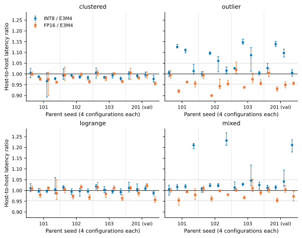
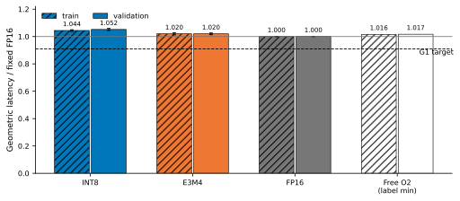

# Lite selector v2: fixed paths pass; free-oracle headroom fails

**Decision: G0 fixed-path checks PASS; G1 STOP; G2/G3 NOT RUN.** Even a free
INT8/E3M4 choice is slower than the strongest fixed format on validation. No
selector was trained, deployed, or timed. The 32 held-out configurations have
zero GPU calls. The failed v1 attempt is preserved unchanged in
[its original report](../lite_selector_20260920/REPORT.md).

## Main result: no room above the strong fixed control

The denominator is the complete synchronized **pageable host FP32 input to
sorted host canonical IDs**, including input validation, transfer, allocation,
format preparation, the full cascade, count readback and output reconstruction.
These are matched prototype paths, not comparisons against a separately tuned
external join implementation. Four fresh processes each execute two warmups and
five retained calls per method/configuration, randomizing method order every
round. A label is the geometric mean of the four within-process medians.

| Split | Fixed INT8 (ms) | Fixed E3M4 (ms) | Fixed FP16 (ms) | Free O2 (ms) | Best fixed / O2 |
|---|---:|---:|---:|---:|---:|
| Train: 48 configurations / 12 parents | 4.057410 | 3.962170 | **3.885729** | 3.946540 | 0.984591 |
| Validation: 16 configurations / 4 parents | 4.072788 | 3.948739 | **3.871661** | 3.937086 | **0.983382** |

O2 takes the smaller INT8/E3M4 label for each configuration and pays **zero**
selection overhead. On validation it is **1.6898% slower than fixed FP16**,
whereas admission required at least **1.10x faster**. This is an observed,
optimistic oracle, not a measured deployable algorithm or a universal lower bound.

The crossover requirement also fails. E3M4 wins by more than 5% in every process
for at least one configuration in **7 parents** (9 configurations); INT8 does so
in **0 parents**. The required count is at least 2 parents for **each** format.
The more restrictive four-configuration parent-aggregate check gives 5 E3M4
parents and 0 INT8 parents. There are 13 non-tie E3M4 labels and 51 ties across
train/validation; no INT8 non-tie label. Neither the workload nor the threshold
was changed to create a crossover.



**Figure 1. E3M4 has repeatable wins over INT8 in outlier/mixed cases, but FP16
remains the strong control.** Each parent has four configurations, ordered
(N=1024,k=8), (1024,128), (4096,8), (4096,128). Points are geometric means of
four process latency ratios; whiskers are their observed minimum/maximum, not
confidence intervals. Values above 1 favor E3M4. Dotted lines mark 1.05 and
1/1.05; crossing a line with one point does not satisfy the all-process gate.



**Figure 2. The cost-free binary oracle still fails to beat FP16.** Lower is
faster. Fixed-path error bars are process-level log Student-t 95% intervals,
with df=3, after equal-parent aggregation. Free O2 uses the preregistered
minimum of four-process labels; it is derived rather than executed and has no
invented measurement error bar. The dashed line is the required 1/1.10 latency.

## Positive and negative mechanism evidence

E3M4 can reduce real refinement work without beating the strongest fixed
format. For validation `mixed_201_n4096_k128`, it reduces the FP32 queue from
**1,964,202 to 205,621 pairs**, and full time from **14.319114 to 11.822075 ms**
(1.211218x INT8/E3M4). However, FP16 needs only **489** FP32 pairs and
**11.499955 ms**. All three retain **23 FP64 pairs** and return identical IDs.
For `outlier_201_n4096_k8`, FP32 counts are 522,245 / 254,751 / 5,806 for
INT8 / E3M4 / FP16; times are 4.733515 / 4.313955 / 4.096373 ms. Each retains
98 FP64 pairs. These are selected mechanism illustrations; all configurations,
including non-wins and slow samples, are retained below and in the raw evidence.

This rejects this round's **binary action set + frozen workload + implementation**
as a useful lightweight-selector candidate. It does not reject native E3M4,
other scales, other certificates, or precision routing generally. No paper
novelty, exact-real guarantee, official CUDA E3M4 API, production admission,
60K result, multi-GPU generalization or external-baseline win is claimed.
Reopen only under a separately frozen hypothesis that creates reproducible
headroom above the strongest fixed format; do not rescue this attempt by
retuning its viewed validation set or charging less selection cost.

## G0 amendment and validation

The user-approved amendment changes **only the independent CPU checking
reference's addition order** and untimed failure logging. It follows the
compiled FP64 terminal: adjacent-square sums, lane XOR 16/8/4/2/1, four-warp
XOR 2/1, then the two 256-element chunks. The independent implementation runs
on CPU; it is a same-finite-predicate check, not an exact-real oracle.

The input/threshold manifest, GPU adapter, all retained GPU kernels, gamma,
classifiers, refinement, timing contract and later gates are unchanged. In
particular, the frozen CPU `np.sum` algorithm used to **construct thresholds**
was not changed. The original one-ULP v1 boundary remains present. This is a new
attempt, not a relabeling of the previous failure.

| Check | Recorded evidence | Result |
|---|---|---|
| New CPU reference qualification | Saved counterexample plus three unrelated random pairs; predecessor/equal/successor thresholds; direct FP64 plus all three fixed paths | 48 full-array checks pass; 12 fresh PTX graph audits |
| Native format identity | Both operands/all 256 codes; documented E4M3/E5M2 controls; disjoint E3M4 anti-fallback value | Pass; raw 0x10 dot gives E3M4=4 versus E4M3=0.0625 |
| Producer and N=97 envelopes | 505 rounding neighbors; 9,409 pair intervals for each of six probe formats | Pass, conditional finite-domain evidence |
| Original + extra fixtures | 14 retained fixtures plus signed/duplicate/abs-one, zero and underflow N=33 | 68 direct/candidate calls pass |
| New train/validation configurations | All 64; full direct reference + three fixed paths, and same CPU32 subset checked by four GPU paths | 512 calls pass |
| Four Compute Sanitizer tools | memcheck/racecheck/initcheck/synccheck; CIFAR prefix512 and three small boundary fixtures | 16 calls/tool; zero errors, zero race warnings/hazards |
| Alternating stress | Four fixtures; 32 INT8/E3M4 calls each plus references | 132 calls pass; 32 distinct input addresses |
| Invalid inputs | Shape, type, layout, finite/range and threshold checks | 9 rejected cases per process |
| G1 complete output equality | All warmups, preparation and retained calls checked against complete direct-reference ID arrays outside timing | 6,400 calls; no mismatch |
| G2 model/forced-router/export gates | Conditional on G1 | NOT RUN; not waived |
| G3 blind test + timed CIFAR | Conditional on frozen admitted model | NOT RUN |

G0 contains 824 recorded direct/candidate calls, in addition to native/numerical
probes. G1 contains 256 direct references, 768 compiler-preparation calls,
1,536 warmups and **3,840 retained calls**. Compile/preparation and G0 latencies
are never used as performance evidence. Each call records the actual kernel
container hashes; each process retains every observed specialization's resource
ledger. All recorded specializations report zero spills. Full cubins are retained
privately; public PTX removes debug/private paths without altering executable
lines. PTX graph identity is architecture/compiler/layout-specific and must be
re-derived after those change.

## Frozen environment and uncertainty

- Eight-GPU server; selected physical **GPU 7**, RTX PRO 6000 Blackwell Server
  Edition, **SM120**, driver **590.48.01**, nvcc **13.1.115**, actual ptxas **13.1**.
- Python **3.12.3**, NumPy **2.3.1**, PyTorch **2.11.0+cu130**, Triton **3.6.0**;
  four CPU library threads. Scikit-learn absent and not installed: G1 stopped.
- Keeper `5678185eb303d892815bf2817423d00897005146`; contract and eleven runtime
  source hashes are attached to every process. Execution was on 2026-09-20 UTC.
- A single guard covered the entire 448.17-second pipeline; five idle preflight
  samples, cooperative locks and continuous selected-GPU process ancestry
  supervision all passed. Other GPUs/processes were not stopped. No GPU reset,
  clock lock or power-limit change was performed. Peak recorded allocated
  memory was 482,427,904 bytes for the three fixed candidate paths and
  679,543,296 bytes for the separate direct-FP64 references; the selected-GPU
  12,000 MiB guard ceiling was never exceeded. Numeric GPU state and all CPU activity samples
  are retained; CPU activity was observed, **not isolated**.
- Each parent's four log ratios are averaged, then parents are equally weighted.
  Four process aggregates produce log Student-t(df=3) 95% intervals. These describe
  timing uncertainty on the frozen synthetic set, not population uncertainty
  across independent real datasets. Shared seeds/prefixes are never split.
- Validation INT8/E3M4 geometric speedup is **1.031415 [1.019999, 1.042958]**.
  FP16/E3M4 is **0.980480 [0.974572, 0.986425]**. These are same-process ratios.
- A separate *process-local-min* O2 summary gives FP16/O2
  **0.984339 [0.981005, 0.987685]**. This is more optimistic and is **not** the
  gate's **0.983382** minimum-of-labels estimator. Both are explicitly retained.
- The known CIFAR anchor is correctness-only in this round, not unseen real
  performance evidence. The floating-dot envelope remains conditional.

## Deliverables and replay

- [CONTRACT.yaml](CONTRACT.yaml): frozen original plan and explicit v2 amendment.
- [workloads.jsonl](workloads.jsonl): all 96 manifests; byte-identical to v1.
  Full synthetic parents are regenerated rather than committed; restricted real
  input data is not redistributed. Only train/validation ran on the GPU.
- [SUMMARY.json](results/SUMMARY.json), [configurations.csv](results/configurations.csv):
  all 64 observed configurations, raw-process medians, p10/p50/p90, output hashes,
  FP32/FP64 queues, memory and gate decisions. Detailed per-call records are
  `results/g0_*.json[l]` and `results/g1_bench_0..3.json[l]`.
- `results/*.compiled.json`, `results/reference_ptx/`, sanitizer logs,
  [GPU supervision](results/GPU_SUPERVISION.json), and compressed
  [complete campaign log](results/campaign.log.gz). Privacy transformations and
  original hashes are listed in [EVIDENCE_MANIFEST.json](results/EVIDENCE_MANIFEST.json).
- [model.json](model.json) is an explicit **not-trained** status, not a model.
  DT1/DT3/RF32 source/models, measured selection overhead breakdown, selection
  loss plots and held-out tables are **NOT PRODUCED**, because G1 prohibits their
  execution. Fixed paths' zero feature/inference fields are not measured router
  overhead. Free-oracle plots must not be relabeled selector results.

CPU-only checks from the repository root (NumPy required):

```sh
python3 lite_selector_20260920/verify_evidence.py
python3 lite_selector_20260920_v2/test_cpu.py
python3 lite_selector_20260920_v2/verify_evidence.py
```

`python3 lite_selector_20260920_v2/summarize.py` reproduces the derived tables.
`plot_results.py` uses matplotlib 3.9.4; it reads only the recorded summary.
See [REPRODUCE.md](REPRODUCE.md) for the guarded GPU replay commands. Do not run
on a busy GPU or overwrite the retained attempt's files. Offline replay verifies
artifact consistency and the saved CPU cases; it does not pretend to rerun GPU
correctness, isolation or timing.

## Claim-evidence / negative-result ledger

| Claim | State | Scope / evidence | Allowed conclusion |
|---|---|---|---|
| Corrected CPU reference agrees with the measured terminal predicate | measured | G0 qualification + all CPU32 checks; source/PTX hashes | Pass on the recorded SM120 graph and cases, not all future compilers |
| Native E3M4 works through the retained private QMMA patch | measured | Native identity and fixed-path G0 | Undocumented measured execution, not a supported CUDA API or new discovery |
| E3M4 reduces refinement and improves full cost on some parents | measured | All-process >5% crossover records | 7 parents qualify; not a universal win |
| A free binary choice has enough headroom over the best fixed format | rejected | Validation best fixed/O2=0.983382 versus required 1.10 | Stop this frozen binary-selector round |
| A learned selector is accurate, low-overhead or faster | unknown | No model or selector timing | No claim; G2/G3 NOT RUN |
| The research thesis has novelty / generalizes / is production-ready | unknown | No such test in this round | No claim; nearest hidden-format/routing prior art remains acknowledged |

Implementation status: fixed-format checks validated, selector unbuilt by stop
rule. Mechanism status: useful E3M4 refinement reductions exist, but insufficient
binary-oracle headroom over FP16 under this contract. Thesis impact: bounded
negative feasibility evidence, not a universal rejection. Reopening requires a
new preregistered mechanism/workload and a decisive same-contract advantage,
not reclassification of this viewed validation set.

## Complete configuration table

Times are label geometric means in ms; O2 is derived. `tie` means <=3% gap or
inconsistent process winner. Full precision, per-process intervals, all queue
counts, peak memory and output counts are in the linked JSON/CSV; no rows are
excluded from aggregation.

| Configuration | Split | INT8 ms | E3M4 ms | FP16 ms | Free O2 ms | Label |
|---|---|---:|---:|---:|---:|---|
| clustered_101_n1024_k8 | train | 1.527593 | 1.521036 | 1.519421 | 1.521036 | tie |
| clustered_101_n1024_k128 | train | 3.303719 | 3.346085 | 3.268476 | 3.303719 | tie |
| clustered_101_n4096_k8 | train | 3.915102 | 4.050745 | 3.948122 | 3.915102 | tie |
| clustered_101_n4096_k128 | train | 11.294137 | 11.531309 | 11.093481 | 11.294137 | tie |
| clustered_102_n1024_k8 | train | 1.534246 | 1.546032 | 1.538812 | 1.534246 | tie |
| clustered_102_n1024_k128 | train | 3.321034 | 3.344982 | 3.296296 | 3.321034 | tie |
| clustered_102_n4096_k8 | train | 3.911248 | 3.967879 | 3.958436 | 3.911248 | tie |
| clustered_102_n4096_k128 | train | 11.595667 | 11.805969 | 11.387163 | 11.595667 | tie |
| clustered_103_n1024_k8 | train | 1.536732 | 1.526650 | 1.531519 | 1.526650 | tie |
| clustered_103_n1024_k128 | train | 3.245975 | 3.297637 | 3.234331 | 3.245975 | tie |
| clustered_103_n4096_k8 | train | 3.895153 | 3.924683 | 3.928002 | 3.895153 | tie |
| clustered_103_n4096_k128 | train | 11.513918 | 11.767194 | 11.369274 | 11.513918 | tie |
| clustered_201_n1024_k8 | validation | 1.524157 | 1.521668 | 1.530367 | 1.521668 | tie |
| clustered_201_n1024_k128 | validation | 3.293600 | 3.322438 | 3.260128 | 3.293600 | tie |
| clustered_201_n4096_k8 | validation | 3.974691 | 3.987635 | 3.969866 | 3.974691 | tie |
| clustered_201_n4096_k128 | validation | 11.619234 | 11.893145 | 11.379327 | 11.619234 | tie |
| outlier_101_n1024_k8 | train | 1.530416 | 1.520777 | 1.515367 | 1.520777 | tie |
| outlier_101_n1024_k128 | train | 3.959579 | 3.516834 | 3.237140 | 3.516834 | e3m4 |
| outlier_101_n4096_k8 | train | 4.501849 | 4.054196 | 3.902919 | 4.054196 | e3m4 |
| outlier_101_n4096_k128 | train | 11.891118 | 11.728435 | 11.208740 | 11.728435 | tie |
| outlier_102_n1024_k8 | train | 1.528839 | 1.528813 | 1.521138 | 1.528813 | tie |
| outlier_102_n1024_k128 | train | 3.936892 | 3.588217 | 3.227070 | 3.588217 | e3m4 |
| outlier_102_n4096_k8 | train | 4.639069 | 4.373125 | 4.123324 | 4.373125 | e3m4 |
| outlier_102_n4096_k128 | train | 12.179100 | 11.993918 | 11.443572 | 11.993918 | tie |
| outlier_103_n1024_k8 | train | 1.537470 | 1.498406 | 1.526754 | 1.498406 | tie |
| outlier_103_n1024_k128 | train | 3.939556 | 3.434408 | 3.220238 | 3.434408 | e3m4 |
| outlier_103_n4096_k8 | train | 4.596160 | 4.226662 | 4.123233 | 4.226662 | e3m4 |
| outlier_103_n4096_k128 | train | 12.125590 | 12.074452 | 11.548379 | 12.074452 | tie |
| outlier_201_n1024_k8 | validation | 1.574278 | 1.531904 | 1.537388 | 1.531904 | tie |
| outlier_201_n1024_k128 | validation | 3.966785 | 3.484153 | 3.244673 | 3.484153 | e3m4 |
| outlier_201_n4096_k8 | validation | 4.733515 | 4.313955 | 4.096373 | 4.313955 | e3m4 |
| outlier_201_n4096_k128 | validation | 12.327925 | 12.260897 | 11.732069 | 12.260897 | tie |
| logrange_101_n1024_k8 | train | 1.502568 | 1.487470 | 1.499786 | 1.487470 | tie |
| logrange_101_n1024_k128 | train | 3.311121 | 3.318568 | 3.250385 | 3.311121 | tie |
| logrange_101_n4096_k8 | train | 3.857433 | 3.866195 | 3.911927 | 3.857433 | tie |
| logrange_101_n4096_k128 | train | 12.497333 | 12.433735 | 12.270085 | 12.433735 | tie |
| logrange_102_n1024_k8 | train | 1.544626 | 1.523107 | 1.530877 | 1.523107 | tie |
| logrange_102_n1024_k128 | train | 3.336750 | 3.357615 | 3.265613 | 3.336750 | tie |
| logrange_102_n4096_k8 | train | 3.841686 | 3.853447 | 3.914861 | 3.841686 | tie |
| logrange_102_n4096_k128 | train | 12.023207 | 12.068803 | 11.688635 | 12.023207 | tie |
| logrange_103_n1024_k8 | train | 1.529909 | 1.501352 | 1.523432 | 1.501352 | tie |
| logrange_103_n1024_k128 | train | 3.432865 | 3.422200 | 3.369444 | 3.422200 | tie |
| logrange_103_n4096_k8 | train | 3.802468 | 3.819473 | 3.863718 | 3.802468 | tie |
| logrange_103_n4096_k128 | train | 12.088964 | 12.183551 | 11.744181 | 12.088964 | tie |
| logrange_201_n1024_k8 | validation | 1.530829 | 1.513281 | 1.530718 | 1.513281 | tie |
| logrange_201_n1024_k128 | validation | 3.331993 | 3.313810 | 3.273792 | 3.313810 | tie |
| logrange_201_n4096_k8 | validation | 3.770260 | 3.736834 | 3.824634 | 3.736834 | tie |
| logrange_201_n4096_k128 | validation | 11.464178 | 11.602762 | 11.098006 | 11.464178 | tie |
| mixed_101_n1024_k8 | train | 1.528802 | 1.519892 | 1.521203 | 1.519892 | tie |
| mixed_101_n1024_k128 | train | 3.513462 | 3.455296 | 3.296388 | 3.455296 | tie |
| mixed_101_n4096_k8 | train | 4.069942 | 3.994597 | 3.969929 | 3.994597 | tie |
| mixed_101_n4096_k128 | train | 14.634711 | 12.094361 | 11.846921 | 12.094361 | e3m4 |
| mixed_102_n1024_k8 | train | 1.536327 | 1.524381 | 1.538606 | 1.524381 | tie |
| mixed_102_n1024_k128 | train | 3.451271 | 3.373183 | 3.244589 | 3.373183 | tie |
| mixed_102_n4096_k8 | train | 4.164939 | 4.069970 | 4.061434 | 4.069970 | tie |
| mixed_102_n4096_k128 | train | 14.459658 | 11.736303 | 11.506478 | 11.736303 | e3m4 |
| mixed_103_n1024_k8 | train | 1.513040 | 1.492801 | 1.494136 | 1.492801 | tie |
| mixed_103_n1024_k128 | train | 3.486374 | 3.388519 | 3.272488 | 3.388519 | tie |
| mixed_103_n4096_k8 | train | 4.134268 | 3.952453 | 3.993170 | 3.952453 | e3m4 |
| mixed_103_n4096_k128 | train | 11.900962 | 11.606381 | 11.494832 | 11.606381 | tie |
| mixed_201_n1024_k8 | validation | 1.523021 | 1.504372 | 1.507941 | 1.504372 | tie |
| mixed_201_n1024_k128 | validation | 3.492308 | 3.441553 | 3.283000 | 3.441553 | tie |
| mixed_201_n4096_k8 | validation | 4.040301 | 3.878855 | 3.895593 | 3.878855 | e3m4 |
| mixed_201_n4096_k128 | validation | 14.319114 | 11.822075 | 11.499955 | 11.822075 | e3m4 |

## Parent-level ratios

Equal-weight geometric ratios over each parent's four configurations and four processes. Ratios above 1 favor E3M4. These are not all-process dominance flags; those flags are in the summary.

| Parent | INT8 / E3M4 | FP16 / E3M4 |
|---|---:|---:|
| clustered_101 | 0.984304 | 0.978021 |
| clustered_102 | 0.988273 | 0.985643 |
| clustered_103 | 0.990416 | 0.987638 |
| logrange_101 | 1.002675 | 0.996505 |
| logrange_102 | 1.000238 | 0.990324 |
| logrange_103 | 1.002427 | 0.993484 |
| mixed_101 | 1.059684 | 0.981895 |
| mixed_102 | 1.067808 | 0.987218 |
| mixed_103 | 1.028389 | 0.991695 |
| outlier_101 | 1.062741 | 0.958442 |
| outlier_102 | 1.042662 | 0.947218 |
| outlier_103 | 1.064759 | 0.971667 |
| clustered_201 | 0.991627 | 0.984654 |
| logrange_201 | 1.003479 | 0.994528 |
| mixed_201 | 1.066990 | 0.983115 |
| outlier_201 | 1.065901 | 0.959954 |
