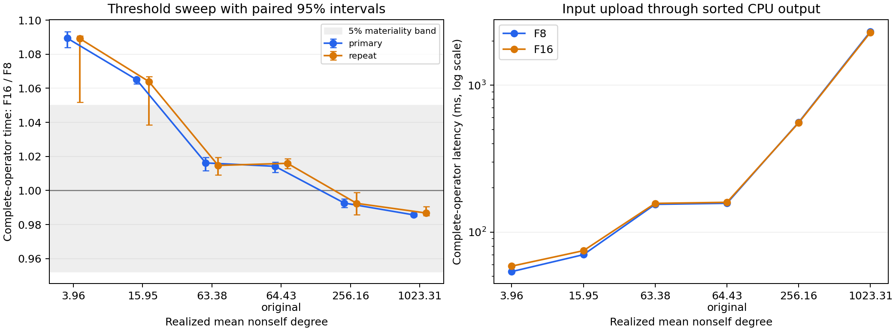

# 阈值扫描实验结果

结论：预登记的两路径路由门槛未通过。

固定原始 60,000 × 512 输入和行顺序，比较现有融合 F8（INT8）与 F16（FP16）完整流程。阈值由固定的 4,194,304 个非自身点对样本选定；全部六个工作点均进入确认和独立复测。

## 端到端结果

下表耗时为主确认组内各进程中位数的均值。R = F16 / F8；大于 1 表示 F8 更快。置信区间按进程和配对重复分层 bootstrap，主确认与复测各 3 个独立进程，每进程每阈值 6 对。

| 工作点 | 半径 ε | 实际平均邻居数 | F8 (ms) | F16 (ms) | 主确认 R [95% CI] | 独立复测 R [95% CI] |
|---|---:|---:|---:|---:|---|---|
| k4 | 0.51074219 | 3.9553 | 54.023 | 58.854 | 1.0894 [1.0839, 1.0933] | 1.0892 [1.0519, 1.0907] |
| k16 | 0.56884766 | 15.9476 | 70.137 | 74.704 | 1.0651 [1.0627, 1.0662] | 1.0639 [1.0386, 1.0668] |
| k64 | 0.62817383 | 63.3833 | 155.704 | 158.222 | 1.0162 [1.0117, 1.0194] | 1.0147 [1.0092, 1.0196] |
| original | 0.62890625 | 64.4346 | 158.117 | 160.363 | 1.0142 [1.0105, 1.0167] | 1.0159 [1.0129, 1.0186] |
| k256 | 0.69189453 | 256.1571 | 564.564 | 560.416 | 0.9927 [0.9901, 0.9951] | 0.9924 [0.9857, 0.9988] |
| k1024 | 0.76171875 | 1023.3134 | 2319.939 | 2286.748 | 0.9857 [0.9849, 0.9867] | 0.9868 [0.9852, 0.9905] |

## 预登记门槛

需要同一对工作点在主确认和复测中分别支持 F8、F16 至少 1.05× 的优势，95% 区间均越过门槛，各进程方向一致；六阈值等查询权重混合下，理想按阈值选择路径的节省还须至少 5%，且区间下界通过。这里的 oracle 假定提前知道每个阈值的最佳路径，未扣除实际选路开销；只衡量整查询选择，不是 tile 级路由。

- 稳定通过 F8 优势门槛的工作点：k4。
- 稳定通过 F16 优势门槛的工作点：无。
- 双向实质性交叉：未通过。
- 主确认：最佳固定路径 F16，理想按阈值选路的端到端节省 0.429% [95% CI 0.394%, 0.451%]。
- 独立复测：最佳固定路径 F16，理想按阈值选路的端到端节省 0.426% [95% CI 0.324%, 0.458%]。

本扫描观察到低密度偏向 INT8、高密度偏向 FP16 的排名交叉，但高密度端优势不足 5%，理想选路总收益也不足 0.5%。依照预登记停止条件，这组输入、阈值和完整输出流程不支持继续将当前两路径 planner 作为研究主线。

## 数值核验和边界

冻结 FP64 终端核实际遍历了全部 1,800,030,000 个含自身的无序点对，生成最大阈值参考集，再用同一核筛出较小阈值。原阈值参考集为 3,926,078 个有向 ID，哈希与旧实验一致。新旧原阈值 F16 核及 metadata 核的 cubin 完全相同。

24 次准入/诊断调用与参考数组逐项相等；另有 672 次计时阶段调用（包含预热，其中 504 次保留测量），每次输出数和完整 SHA256 均匹配参考。全部 10 个独占守护进程通过，峰值显存 1392 MiB。

结果只支持此数据、硬件和阈值集合上的冻结 FP64 参考语义一致性；不是 exact-real join，也不消除继承的 FP16 Tensor Core 误差前提（[原数值边界说明](inherited/NUMERICAL_SCOPE.md)）。每个新 constexpr 阈值均捕获 cubin/PTX/IR，检查 HMMA、定向舍入、无 FTZ、无 spill/local/scratch，保存 CUDA 参数 ABI。

## 耗时与队列诊断

下表来自独立诊断调用，GPU 事件时间及阶段拆分不用于性能门槛。U1 为进入 FP32 精化的无序点对数；两路径的最终 FP64 队列数在各阈值均一致。

| 工作点 | F8 U1 | F16 U1 | FP64 队列 | F8 排序占比 | F16 排序占比 |
|---|---:|---:|---:|---:|---:|
| k4 | 118,818 | 4,865 | 90 | 10.7% | 9.6% |
| k16 | 472,673 | 21,101 | 404 | 27.2% | 25.7% |
| k64 | 1,798,393 | 84,596 | 1,685 | 58.7% | 56.7% |
| original | 1,827,007 | 86,029 | 1,734 | 59.5% | 57.8% |
| k256 | 6,797,360 | 343,252 | 7,170 | 82.9% | 82.4% |
| k1024 | 24,559,702 | 1,290,141 | 27,860 | 89.5% | 90.8% |

在 k1024 工作点，F16 的 FP32 候选队列约缩小 19 倍，但完整输出达 61,458,806 个有向 ID，CPU 镜像和排序约占诊断端到端耗时的 89%–91%。这解释了为何精化阶段的改善只带来很小的整体优势。此诊断不证明排序实现无法改进；本扫描严格保留现有的共同输出流程。

完整计时包含 tile 列表构造、输入上传、metadata、队列、计数器同步、结果下载和 CPU 镜像排序；不含 JIT、输入磁盘读取、哈希核验及预热。行未重排，因此未添加旧布局实验的额外 identity remap，不能直接与旧布局实验绝对耗时相除。

## 进程与顺序敏感性

| 工作点 | 主确认三个进程 R | 复测三个进程 R | 主确认 F8先/F16先 | 复测 F8先/F16先 |
|---|---|---|---|---|
| k4 | 1.0882, 1.0875, 1.0927 | 1.0891, 1.0898, 1.0888 | 1.0894/1.0904 | 1.0895/1.0898 |
| k16 | 1.0663, 1.0636, 1.0655 | 1.0621, 1.0651, 1.0645 | 1.0651/1.0655 | 1.0643/1.0636 |
| k64 | 1.0173, 1.0140, 1.0173 | 1.0103, 1.0175, 1.0164 | 1.0167/1.0144 | 1.0155/1.0167 |
| original | 1.0131, 1.0127, 1.0168 | 1.0142, 1.0158, 1.0178 | 1.0146/1.0146 | 1.0178/1.0146 |
| k256 | 0.9908, 0.9923, 0.9949 | 0.9919, 0.9956, 0.9898 | 0.9918/0.9915 | 0.9925/0.9918 |
| k1024 | 0.9859, 0.9859, 0.9853 | 0.9858, 0.9866, 0.9880 | 0.9861/0.9850 | 0.9896/0.9851 |

不按耗时删除样本；粗扫结果单独留存，不并入确认估计。每个确认区块只有三个进程簇，因此置信区间的解释限于本次重复测量。

## 文件与复现

- [冻结方案](PROTOCOL.md) 和 [统计细节](ANALYSIS_PLAN.md)。
- [完整统计 JSON](analysis/summary.json)、[汇总 CSV](analysis/summary.csv)、[原始计时 CSV](analysis/raw_times.csv)、[独立阶段诊断 CSV](analysis/diagnostics.csv)。
- [阈值及样本哈希](artifacts/thresholds.json)、[参考集清单](artifacts/reference_manifest.json)、[准入与二进制审计](artifacts/admission.json)、[环境与原核比对](artifacts/environment.json)。
- 远程完整实验目录：`@TENSORJOIN_ROOT@/tensorjoin_20260902_certified_exact_join/precision_routing_20260908_threshold_sweep`；参考 NPY 与上三角分片保留在该目录。
- 本地同步源码、编译产物、日志、结果、守护记录；未复制约 1 GiB 的参考数组。`python analyze.py` 可从同步的结果重新生成统计和图。
- 在原服务器使用相同环境和输入，从新目录按 `select_thresholds.py → reference.py → admit.py → run_campaign.py` 执行；GPU 调用必须经 `guard_r2.py`。现有结果禁止覆盖。
