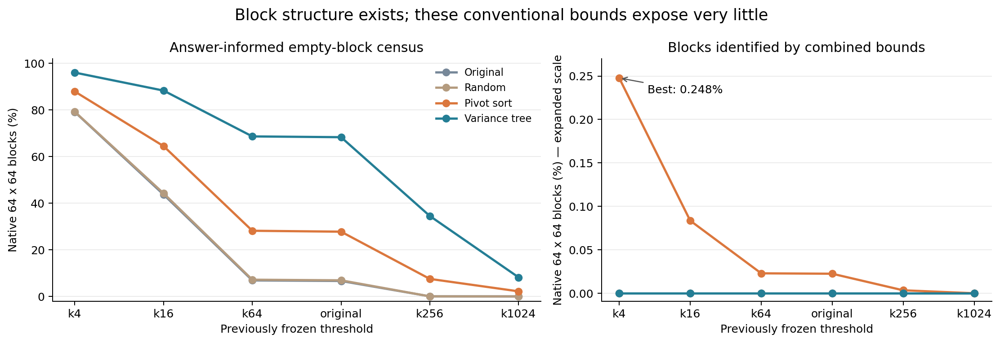

# 块内结构与判界成本小实验

**结论：存在明显的成块结构，但本轮三类常规几何界未能有效识别；停止这组方案的 GPU 实现投入。**

在已有 60,000×512 输入、六个冻结阈值上，完成四种分组 × 三种块大小 × 四种判界方式，共 288 个配置。CPU 主实验用时 160.0 秒，峰值进程 RSS 1416.5 MiB。没有运行新的 GPU 距离算子。

## 核心结果：空块数量与可识别空块数量差距很大

以下均为现有核可直接对应的 64×64 块，共 440,391 块，覆盖 1,800,030,000 个上三角 pair（含自身）。空块比例使用完整参考答案事后普查，仅表示结构机会；实际剪枝使用输入摘要，二者不能混用。

| 分组 | k4 空块 | 原始阈值空块 | k1024 空块 | 六阈值中最大实际剪枝 |
|---|---:|---:|---:|---:|
| 原始顺序 | 79.09% | 6.63% | 0.00% | 0.0000% |
| 随机分组 | 79.21% | 6.91% | 0.00% | 0.0000% |
| pivot 距离排序 | 87.89% | 27.77% | 2.18% | 0.2477% |
| 几何树分组 | 96.02% | 68.30% | 8.19% | 0.0000% |

原始阈值下，几何树分组将空块从 29,176 个增加到 300,809 个（6.63% → 68.30%），但组合界仍无法排除任何块。这支持“存在可利用布局结构”，没有证明已经找到利用它的方法。

最好实际配置是 pivot 距离排序、64×64、k4：排除 1,091/440,391 块（0.2477%），覆盖 3,665,920 个 pair（0.2037%）。它只识别出该配置真实空块的 0.2819%。

几何树分组下，组合界的最大下界仅 0.107315，最小上界为 2.075071；六阈值位于 0.260858–0.580215。这解释了它为何无法决定任何块。下界与最小阈值的差距远大于 2^-20，去掉该保护量也不会让这一分组产生排除块。

图右轴扩大到 0.27%，左轴为 0–100%；请注意尺度差异。图中所有完整接受块均为零，因此可决定块在本实验中就是空块。

## 实验方法与边界

- 分组：原始顺序、固定随机排列、按一个 pivot 的距离稳定排序、按最大方差坐标递归分割的几何树。顺序仅由输入生成，不访问答案或阈值。
- 块大小：32、64、128。32×32 结果属于结构诊断，现有 64×64 核不能直接据此跳过四分之一块。
- 判界：512 维坐标包围盒、均值中心及最大半径球界、16 个固定 farthest-first pivot 的距离区间；组合界取最大下界和最小上界。它们是常规方法，不主张新颖性。
- 使用 FP64 原型并给平方距离界向外扩展 2^-20。这个固定保护量不是本轮证明出的普适数值证书。
- 每个配置的直接接受/拒绝都与之前逐 pair 全量执行冻结 FP64 终端所得参考结果核验。没有通过抽样估计空块比例。

## 成本与停止决定

CPU 原型阶段的单次诊断如下。所有布局均计算相同元数据；这些数值没有 GPU 实现优化，不能当作 GPU 判界延迟，也不能与旧 GPU 完整时间直接相除宣称加速或减速。

| 原始顺序、64×64 | CPU 时间 |
|---|---:|
| box 全块判界 | 2812.81 ms |
| sphere 全块判界 | 599.72 ms |
| pivot 全块判界 | 125.33 ms |
| combined 全块判界 | 3541.24 ms |
| 全输入 16-pivot 距离预处理（公共） | 1296.00 ms |

分组、元数据构造、判界和参考普查时间分别保存在 CSV 中；参考普查不计入可部署方法的成本。共享元数据原型计算三类界所需的全部摘要，不将该时间冒充单一界的最优准备成本。

协议在测量前规定：至少有一个 64×64 配置可决定 20% 的块，才进入 GPU 成本微测。本轮最高 0.2477%，因此没有进入 GPU 阶段。这一停止依据是可消除的工作太少；没有用 CPU 原型较慢来推断 GPU 实现一定较慢。

## 核验与可复现性

全部 288 配置：错误排除块数 0，错误接受块数 0。独立校验另外直接构造 221 个块的 pair ID，进行 1326 次参考集合查找核对和 884 次直接 FP64 距离区间检查，全部通过。该抽查用于核验普查程序，不能替代前述全量判定核验。分析脚本又从保存的数组重新计算了全部 288 个配置。

分离簇正对照能够同时接受和排除整块；另覆盖非整块尾部、重复点和阈值相等，避免将“判界实现始终不做决定”的错误当作负结果。数值结论限于本轮输入和冻结参考合同。

本实验只有一个真实数据集，六个阈值不是六个独立数据集。完整普查没有抽样置信区间；CPU 单次诊断没有进程复测置信区间。

## 对 TensorJoin 机制探索的意义

本轮把问题具体化了：几何分组可以集中真实邻接关系，但包围盒、球界和少量 pivot 区间对这些块仍然太松。下一项机制必须解释怎样用廉价摘要识别那些真实空块，并保持矩阵执行效率；单纯优化这三类判界核或再加一个调度器，当前证据不足以支持。

这个差距是研究线索，不是算法创新或性能收益。它没有否定其他更紧的界、其他分组方法或其他数据分布；也没有证明这些替代方向一定有效。

## 文件

- [冻结协议](PROTOCOL.md)、[完整 CSV](analysis/summary.csv)、[结果 JSON](results/probe.json)。
- [独立核验](results/independent_verification.json)、[输入与参考哈希](artifacts/input_freeze.json)、[界分位数](analysis/bound_quantiles.json)。
- `src/probe.py` 为主实验，`src/verify.py` 为独立校验，`analyze.py` 重新生成报告和图。
- `artifacts/order_*.npy`、`bounds_*.npz`、`counts_*.npz` 保存排列、所有块界和参考计数；原始大输入与完整参考仍由哈希指向服务器既有目录。
- 服务器实验目录：`@TENSORJOIN_ROOT@/tensorjoin_20260902_certified_exact_join/tensorjoin_20260908_block_probe`。
