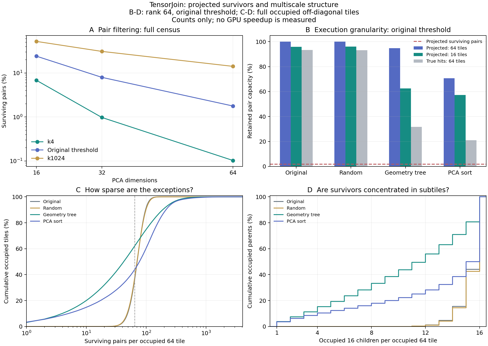

# 未决 pair 的多尺度结构探针

**结论：低维判界后的任务确实稀疏，几何布局能使其中一部分集中；当前 64×64 整块执行仍会放大剩余工作。实验建立了结构证据，没有建立 GPU 净收益或挂谷方法的新颖性。**

原始阈值 T=0.3955230712890625 下，64 维投影仅保留 1.78% 的上三角 pair（含自身），其中真实命中只占全部 pair 的 0.11%。仍有 93.77% 的候选并不是真实命中，需要后续判定。

## 1. 信息是否足够：少数投影维度已能排除大多数 pair

以下候选比例在四种布局间完全相同；改变顺序改变的是候选的位置和块覆盖，不改变 pair 判界结果。PCA 方差比例仅作描述，安全性来自逐 pair 下界及数值保护。

| 投影维度 | 平均方差覆盖 | k4 未决 pair | 原始阈值未决 pair | k1024 未决 pair |
|---|---:|---:|---:|---:|
| 16 | 54.33% | 6.85% | 24.18% | 52.34% |
| 32 | 66.82% | 0.98% | 7.97% | 30.99% |
| 64 | 78.53% | 0.10% | 1.78% | 14.17% |

## 2. 布局与粒度：同样数量的候选，覆盖的矩阵区域不同

下表固定原始阈值和 64 维投影。“保留容量”指每个含候选的块都完整执行时，其覆盖的 pair 数 / 全部上三角 pair 数；计入对角线和尾块。它不是实际 GPU 工作量或运行时间。

| 布局 | 256 块保留容量 | 64 块保留容量 | 16 块保留容量 | 只按真实命中保留 64 块（oracle） |
|---|---:|---:|---:|---:|
| 原始 | 100.00% | 100.00% | 95.89% | 93.38% |
| 随机 | 100.00% | 100.00% | 96.08% | 93.09% |
| 几何树 | 99.76% | 94.81% | 62.55% | 31.66% |
| PCA 排序 | 76.01% | 70.70% | 57.22% | 21.03% |

原始/随机布局说明：全局 pair 稀疏不自动产生空子块。几何布局与它们有相同的候选 pair 总数，因此子块占用差异是位置组织的证据。Oracle 列使用完整答案，不能作为可部署判界方法。

## 3. 困难是否只涉及少量 pair、行或列

仅统计仍有候选的、完整的、非对角 64×64 块。行列条件表示“所有候选涉及不超过 8 行，或不超过 8 列”，不表示能忽略任何剩余候选。条件分母会随布局改变，必须结合上一表看。

| 布局 | 候选数中位数 / 4096 | 至多 6 个 pair | 至多 64 个 pair | 可覆盖于 ≤8 行或列 | 活跃行数中位数 |
|---|---:|---:|---:|---:|---:|
| 原始 | 71 | 0.00% | 36.00% | 0.00% | 28 |
| 随机 | 71 | 0.00% | 37.38% | 0.00% | 28 |
| 几何树 | 43 | 13.84% | 62.03% | 31.96% | 18 |
| PCA 排序 | 77 | 11.13% | 43.89% | 19.06% | 26 |

## 4. 跨尺度结构

每个完整非对角父块有 16 个子块。下表的活跃子块数只对占用父块统计；容量减少则按全量 pair 容量计算。它们回答不同问题，不能混用。

| 布局 | 256→64 容量减少 | 256 块内活跃 64 子块均值 | 64→16 容量减少 | 64 块内活跃 16 子块均值 |
|---|---:|---:|---:|---:|
| 原始 | 0.00% | 16.00/16 | 4.11% | 15.34/16 |
| 随机 | 0.00% | 16.00/16 | 3.92% | 15.37/16 |
| 几何树 | 4.96% | 15.22/16 | 34.03% | 10.55/16 |
| PCA 排序 | 6.98% | 14.88/16 | 19.07% | 12.94/16 |

集中程度没有在所有层级都保持同样强：原始阈值下，几何树的 64→16 容量减少达到 34.03%，256→64 仅为 4.96%。因此只有局部层级的集中证据，尚未得到“多个尺度上持续强集中”的证据。

这验证了在本数据与投影判据下，困难具有布局相关的集中结构；并没有验证挂谷证明中管束的方向关系或 sticky 条件。这里的“跨尺度”特指同一排列上的嵌套矩阵块。

## 5. 六阈值全部保留

以下固定几何树布局与 64 维投影；PCA 排序及其余维度的全部结果见 CSV/JSON。

| 阈值 | 未决 pair | 保留 64 块容量 | 保留 16 块容量 | ≤64 pair 的占用 64 块 | ≤8 行或列的占用 64 块 |
|---|---:|---:|---:|---:|---:|
| k4 | 0.10% | 49.73% | 11.25% | 98.66% | 91.43% |
| k16 | 0.47% | 80.43% | 33.31% | 91.68% | 66.31% |
| k64 | 1.75% | 94.72% | 62.22% | 62.52% | 32.31% |
| original | 1.78% | 94.81% | 62.55% | 62.03% | 31.96% |
| k256 | 5.48% | 98.96% | 84.03% | 25.53% | 10.93% |
| k1024 | 14.17% | 99.80% | 94.82% | 6.27% | 2.43% |

## 6. 预设筛选规则与研究含义

协议事先把“少量例外”定义为：至少 20% 的占用原生块仅有 ≤64 个候选，或可覆盖于 ≤8 行/列；把“子块机会”定义为细分后覆盖容量至少减少 20%。这些是内部描述门槛，不是论文或性能门槛。

| 布局（原始阈值，64 维） | 少量例外门槛 | 256→64 子块门槛 | 64→16 子块门槛 |
|---|---|---|---|
| 原始 | 通过 | 未通过 | 未通过 |
| 随机 | 通过 | 未通过 | 未通过 |
| 几何树 | 通过 | 未通过 | 通过 |
| PCA 排序 | 通过 | 未通过 | 未通过 |

下一项机制若继续验证，应聚焦“判界后按子块或少量行列组织剩余计算”，与完整 64 块回退比较。需要同时计入投影、判界、任务压缩、调度、低占用矩阵执行、精化和完整排序 CPU 输出。先前已有投影界/过滤—精化先例；本轮结构分布本身不构成新颖性。

必须保留 PCA 排序这个强对照：虽然它的 64→16 相对容量减少仅为 19.07%，其绝对保留容量在 64 与 16 粒度上都低于几何树（70.70% / 57.22%，对比 94.81% / 62.55%）。不能因为几何树通过细分门槛，就宣称它的完整算法更优。

原始及随机布局也可能通过“少量例外”门槛，却不通过子块容量门槛。这说明不能仅凭每块 candidate 数少就认定可以高效细分；必须保留随机对照和执行成本测试。

## 7. 正确性、成本与范围

- 4 布局 × 3 投影维度 × 6 阈值 × 4 块大小，共 288 个投影配置；另有 96 个 oracle 配置。每个布局/维度完整覆盖 1,800,030,000 个上三角 pair，含自身。
- 在实际流式掩码中执行 518,108,916 次参考阳性 pair 保留核验（跨布局、维度、阈值重复覆盖），零错误排除。参考文件哈希全部匹配。这里没有重新计算全部原维 FP64 距离，也没有运行新完整 join。
- 独立程序对每布局 33 个预先固定的块进行直接投影距离、参考集合查找和尾块/对角线检查；共 124,800 次子块计数核对、12,528 次行列统计核对，全部通过。
- 独立查表共 8,159,232 次；原维直接距离下界检查 1,359,872 次。独立检查补充全量阳性保留核验，不替代数值证明。
- 聚合程序从保存的整数计数重算全部配置：跨尺度计数守恒、候选包含全部真值、四种布局的逐阈值/逐维候选总数一致；投影维度与阈值的单调性检查通过。
- 主 CPU 进程用时 686.4 秒，峰值子进程 RSS 1974.6 MiB。四线程，未使用 GPU。单次时间为诊断，没有计时置信区间。
- PCA 构造（含输入加载）0.403 秒，投影与排序分数计算 0.081 秒；各布局的参考普查、矩阵乘法、掩码统计、压缩保存耗时另存 results/*.json。这些不是 GPU 判界或端到端延迟。原始/随机/几何树排列复用归档，PCA 排序未单独计时；本轮没有评测完整构建成本。
- 数值保护按实际表示的投影矩阵范数、坐标误差、FP64 Gram 运算误差及冻结终端误差向外扩展。未使用无保护的 PCA 距离或平均方差作拒绝依据；数值主张限于本输入与继承合同。
- 只有一个先前已探索的数据集；六阈值不是六个独立数据集。完整普查无需抽样置信区间，但不能由此声称跨数据集泛化。

## 文件与复现

- [冻结协议](PROTOCOL.md)、[全部配置 CSV](analysis/summary.csv)、[原生块统计](analysis/native64.csv)、[跨尺度统计](analysis/branches.csv)。
- [独立核验](results/independent_verification.json)、[全量聚合核验](results/analysis_verification.json)、[主进程](results/process.json)、[原始日志](raw/probe.log)。
- `artifacts/` 保存投影、排列、数值保护和逐阈值上三角 16 子块计数；投影配置另外保存 64 块活跃行列数。真值仅用于核验和 oracle 统计。
- 远程目录：`@TENSORJOIN_ROOT@/tensorjoin_20260902_certified_exact_join/tensorjoin_20260908_multiscale_probe`。输入与参考沿用父目录，路径与哈希在 `artifacts/input_freeze.json`。
- 复现顺序：在新的同级目录中运行 `python3 run_cpu.py`、`python3 analyze.py`、`python3 src/verify.py`；绘图运行 `python3 plot.py`，生成报告运行 `python3 finalize.py`。CPU 环境设置见 run_cpu.py；不要覆盖已有原始测量。
