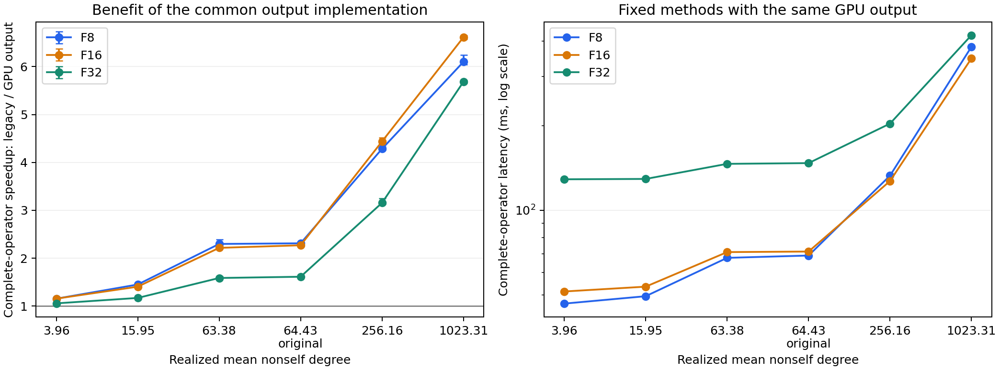

# 共享输出优化与基线审计

结论：建议采用 `gpu_radix` 公共输出实现。该结果属于共同执行流程的工程改进，未建立新的精度规划器或算法新颖性。

原始数据为 60,000 × 512 FP32；沿用已冻结六个阈值、输入顺序、全部 FP64 参考结果。F8、F16 的数值核逐字节保持不变；F32 使用已有 pedantic cuBLAS + 冻结分类核 + FP64 终端。三条路径共享同一个输出实现，完整结果仍是 CPU 上升序排列的全部有向 uint64 pair ID。

## 输出优化收益

| 独立区块 | 原公共输出平均耗时 | 新公共输出平均耗时 | 完整加速 | 耗时节省 [95% CI] |
|---|---:|---:|---:|---|
| 主确认 | 580.661 ms | 147.244 ms | 3.944× | 74.64% [74.56%, 74.93%] |
| 独立复测 | 580.757 ms | 146.845 ms | 3.955× | 74.71% [74.60%, 74.93%] |

平均值按六个阈值 × 三种算子的 18 个组合等调用权重计算；每格先取各进程保留测量的中位数，再平均。主确认与复测各三个新进程，每格四对测量。置信区间来自成对输出测量和进程簇的分层 bootstrap。

超过 5% 的可复现退化组合：无。各组合的原始计时均保留，不按速度剔除。

| 工作点 | 方法 | 原输出 ms | 新输出 ms | 主确认加速 [95% CI] | 复测加速 [95% CI] |
|---|---|---:|---:|---|---|
| k4 | F8 | 53.980 | 46.770 | 1.154× [1.144, 1.201] | 1.154× [1.139, 1.186] |
| k4 | F16 | 59.213 | 51.438 | 1.151× [1.134, 1.182] | 1.158× [1.134, 1.198] |
| k4 | F32 | 136.787 | 129.571 | 1.056× [1.048, 1.063] | 1.056× [1.049, 1.062] |
| k16 | F8 | 73.171 | 50.037 | 1.462× [1.432, 1.483] | 1.437× [1.431, 1.449] |
| k16 | F16 | 75.451 | 53.372 | 1.414× [1.395, 1.445] | 1.396× [1.392, 1.401] |
| k16 | F32 | 151.385 | 129.386 | 1.170× [1.162, 1.176] | 1.169× [1.161, 1.174] |
| k64 | F8 | 153.982 | 66.671 | 2.310× [2.227, 2.523] | 2.285× [2.264, 2.301] |
| k64 | F16 | 157.413 | 71.072 | 2.215× [2.179, 2.347] | 2.216× [2.182, 2.352] |
| k64 | F32 | 233.408 | 147.888 | 1.578× [1.558, 1.624] | 1.594× [1.560, 1.660] |
| original | F8 | 159.186 | 68.987 | 2.307× [2.293, 2.336] | 2.313× [2.304, 2.329] |
| original | F16 | 161.796 | 71.358 | 2.267× [2.228, 2.280] | 2.271× [2.256, 2.287] |
| original | F32 | 237.856 | 148.444 | 1.602× [1.589, 1.610] | 1.622× [1.616, 1.629] |
| k256 | F8 | 568.185 | 133.150 | 4.267× [4.241, 4.303] | 4.300× [4.268, 4.371] |
| k256 | F16 | 563.483 | 126.826 | 4.443× [4.425, 4.598] | 4.432× [4.377, 4.467] |
| k256 | F32 | 641.652 | 204.522 | 3.137× [3.110, 3.158] | 3.173× [3.144, 3.341] |
| k1024 | F8 | 2335.875 | 383.006 | 6.099× [6.048, 6.379] | 6.102× [5.982, 6.170] |
| k1024 | F16 | 2302.812 | 348.004 | 6.617× [6.558, 6.662] | 6.610× [6.559, 6.691] |
| k1024 | F32 | 2386.259 | 419.894 | 5.683× [5.655, 5.706] | 5.685× [5.628, 5.744] |

图使用六个确认进程合并的描述性估计；替换门槛仍分别按主确认和复测区块判断。

## 共享新输出后的计算路径比较

以下均使用相同的新输出实现；主确认与复测分开报告。F32 是本机已有的 pedantic FP32 强对照，不代表已复现所有外部系统。F32/F16 大于 1 表示 F16 更快；F16/F8 大于 1 表示 F8 更快。

| 工作点 | F8 ms | F16 ms | F32 ms | F32/F16 主确认 / 复测 | F16/F8 主确认 / 复测 |
|---|---:|---:|---:|---|---|
| k4 | 46.770 | 51.438 | 129.571 | 2.519 / 2.501 | 1.100 / 1.109 |
| k16 | 50.037 | 53.372 | 129.386 | 2.424 / 2.415 | 1.067 / 1.097 |
| k64 | 66.671 | 71.072 | 147.888 | 2.081 / 2.044 | 1.066 / 1.031 |
| original | 68.987 | 71.358 | 148.444 | 2.080 / 2.051 | 1.034 / 1.032 |
| k256 | 133.150 | 126.826 | 204.522 | 1.613 / 1.591 | 0.953 / 0.961 |
| k1024 | 383.006 | 348.004 | 419.894 | 1.207 / 1.213 | 0.909 / 0.910 |

各路径比值的 95% 区间和逐进程耗时见 [完整统计](analysis/summary.json)。不同计算方法在独立方法块测量，因此统计配对依赖进程簇；不把不相关的方法调用冒充逐次配对。

作为描述性敏感性结果，六阈值等概率、提前知道最佳路径且不扣选择开销时：

- 主确认最佳固定 TC 路径为 F16；F8/F16 理想选路节省 2.046% [1.376%, 2.762%]。
- 复测最佳固定 TC 路径为 F16；F8/F16 理想选路节省 1.958% [1.616%, 2.180%]。

该描述性结果未实现选择器，也不重开上一轮已停止的 planner 研究主张。

## 改动和对照

- `legacy`：每批上三角结果下载，排序上三角 ID，镜像，再排序完整 ID。
- `cpu_single`：相同下载流程，删除第一遍上三角排序，镜像后统一排序。
- `gpu_radix`：每批结果保留 GPU 副本，拼接后以整数 ID 镜像，调用 NVIDIA CUB 64 位无符号 radix sort，再下载最终有序结果。自身的额外镜像用最大 uint64 哨兵表示，排序到末尾后按实际自身计数删除。

GPU 改进包含结果暂存、镜像、排序和传输流程的整体变化，不能把全部收益归因于单个排序核。结果规模、设备临时空间和复制成本都进入完整计时；未使用参考结果规模预分配。

两轮粗测的平均完整耗时如下；这部分只用于按已写明的统一规则选输出实现，不并入确认估计：

| 输出实现 | 粗测平均耗时 |
|---|---:|
| legacy | 583.256 ms |
| cpu_single | 474.075 ms |
| gpu_radix | 148.925 ms |

## 数值核验和资源代价

54 个正常配置和 18 次单独诊断均与已有完整 FP64 参考数组逐项相等；空结果、自身、乱序、非整块长度、超过有符号 32 位范围的 ID、越界输入检测和前后哨兵检查均通过。另有 1404 次计时阶段调用，其中 1080 次保留测量，每次输出数量和完整 SHA256 均匹配参考。

所有 9 个守护进程通过；守护采样的最大设备用量 3172 MiB。计时调用的最大 PyTorch 已分配显存 1994.2 MiB、保留显存 2480.0 MiB；最大 CUB scratch 为 479.8 MiB。

GPU 版本在 k1024 下载完整有向结果 491,670,448 字节；旧流程仅下载上三角 246,075,224 字节再由 CPU 镜像。因此改进需要更多 D2H 字节和 GPU 临时空间，并非通过减少最终答案或压缩输出合同取得。

CUB 版本宏为 300104，nvcc 为 CUDA 13.1。完整编译命令、编译器/源码/共享库和全部编译依赖哈希保存在 [build.json](artifacts/build.json)。F16 计算核和 metadata 均与原阈值扫描捕获产物字节一致；FP32 的库配置、库哈希和冻结核身份保存在准入证据中。

数值结论限于此输入、阈值、硬件和冻结 FP64 判定过程；不主张 exact-real 语义，也不消除继承的 FP16 数值前提。复测每块仅三个进程簇，区间不代表跨硬件或跨数据分布泛化。

## 基线和研究结论

本轮证明了共同输出实现存在可修复的性能问题，并建立了更快且公平共享的完整输出对照。没有增加新的距离算法或精度选择机制。外部 FaSTED 与 RT-HiSS 的机制和合同核查见 [基线范围](BASELINE_SCOPE.md)；本轮未运行它们的实现。

后续算法研究必须相对这个改进后的公共执行器衡量净收益。若探索块级剪枝，应单独固定覆盖 FP64 参考判定的界、真实数据集合、判界开销和停止条件；现有输出加速不能充当剪枝有效或新颖性的证据。

## 复现文件

- [协议](PROTOCOL.md)、[统计细节](ANALYSIS_PLAN.md)、[选型证据](artifacts/selection.json)。
- [汇总 CSV](analysis/summary.csv)、[全部原始计时 CSV](analysis/raw_times.csv)、[单独阶段诊断 CSV](analysis/diagnostics.csv)、[完整统计](analysis/summary.json)。
- [准入及阶段诊断](artifacts/admission.json)、[冻结文件](artifacts/timing_freeze.json)、[环境](artifacts/environment.json)、[独立统计交叉核对](analysis/independent_verification.json)、[最终资源检查](results/final_resource_check.json)。
- 源码在 `src/`；GPU 输出实现为 `src/output.cu` 和 `src/common.py`。`python analyze.py` 从结果重新生成统计与图。
- 原服务器实验目录：`@TENSORJOIN_ROOT@/tensorjoin_20260902_certified_exact_join/tensorjoin_20260908_output_audit`。同级旧阈值扫描目录保留全部大型参考 NPY；本轮直接核验其哈希并复用。
