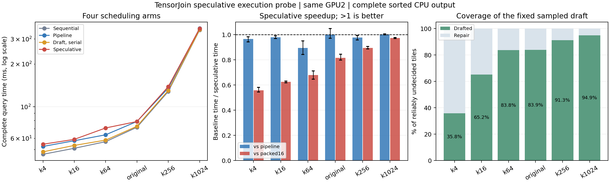

# TensorJoin 可认证投机执行小实验

实验日期：2026-09-08。主机：8p / gpu-host-8。GPU2：RTX PRO 6000 Blackwell Server Edition。

**结论：本轮投机执行未通过预设的 5% 净收益门槛，停止这套固定原型的继续调参。**

六阈值等查询权重下，普通流水线为 **124.23 ms**，投机执行为 **126.36 ms**。投机相对流水线的时间节省为 **-1.71%**（负数表示更慢）。最强固定旧对照为行列压紧，平均 **108.40 ms**；投机相对它的时间节省为 **-16.57%**。

## 1. 实际实现与对照

使用完整 CIFAR 60,000×512 FP32 输入和六个冻结阈值。复用输入构造的 PCA 排列与 64 维投影；每次查询重新上传 GPU 并构造完整维度 FP16 元数据。最终返回完整、升序的有向 CPU pair 数组，含自身连接，匹配冻结 FP64 判定合同。

提案规则固定为每个 64 点块取偏移 0、4、…、60 的 16 个代表点，计算其 16×16 个 64 维投影距离。完整验证仍检查每个块的全部 64×64 投影 pair。设提案集合为 D，可靠未决集合为 U，实际执行 D 与 U\D 两个互不相交的队列。任何提案遗漏均被完整验证发现并补全。

| 方式 | 实际流程 |
|---|---|
| 串行验证后执行 | 全量生成可靠队列，再计算 |
| 普通流水线 | 下一批可靠判界与当前批计算重叠，当前批等待验证完成 |
| 串行提案 | 生成提案和补全队列，再依次计算二者 |
| 投机执行 | 同样的验证预取距离，草稿计算可以先于当前验证完成，随后计算补全队列 |

四组使用相同的固定 4096 输入 tile 分批、GPU 队列和距离核。设备计数控制实际计算，队列未使用位置直接退出。草稿与补全共享每批的一次 FP32 精化／FP64 终端，避免把两次精化同步额外强加给投机组。普通流水线和投机组最多提交当前及下一批验证，不无限提前排队。

额外保留原顺序 FP16、原有全局压缩的 project64 和 packed16 行列压紧三个强对照。它们在本轮同一 GPU、同一进程组内重测；没有使用旧实验耗时计算加速。新四组的固定输入分批不同于旧对照的全局工作表压缩，这一影响不能算作投机收益。

## 2. 完整查询时间

单位 ms。先取每个进程四次保留测量的中位数，再对三个进程等权平均。全部包含上传、元数据、提案／验证、任务队列、事件等待、距离计算、精化、ID 恢复、CUB 排序和 CPU 下载。CPU 索引构建单独报告。

| 阈值 | 原 FP16 | 投影＋整块 | 行列压紧 | 串行验证 | 流水线 | 串行提案 | 投机 |
|---|---:|---:|---:|---:|---:|---:|---:|
| k4 | 53.89 | 38.40 | 30.48 | 46.36 | 52.64 | 48.23 | 54.56 |
| k16 | 56.04 | 44.78 | 36.87 | 51.08 | 57.75 | 53.53 | 59.04 |
| k64 | 59.15 | 52.17 | 48.19 | 56.87 | 63.57 | 58.32 | 71.02 |
| original | 66.29 | 66.77 | 64.22 | 71.85 | 78.89 | 72.97 | 78.82 |
| k256 | 135.32 | 125.87 | 124.22 | 128.37 | 135.67 | 130.43 | 138.86 |
| k1024 | 346.96 | 348.53 | 346.41 | 347.30 | 356.88 | 349.36 | 355.87 |
| 六阈值等权 | 119.61 | 112.76 | 108.40 | 116.97 | 124.23 | 118.81 | 126.36 |

| 比较：投机相对基线 | 整体时间节省 | 三进程各自节省 |
|---|---:|---|
| 串行验证后执行 | -8.03% | -7.80%, -7.83%, -8.46% |
| 普通流水线 | -1.71% | -0.91%, -2.14%, -2.09% |
| 串行提案 | -6.36% | -6.17%, -5.76%, -7.15% |
| 行列压紧 | -16.57% | -15.91%, -16.60%, -17.20% |

门槛要求：投机相对普通流水线及最强固定旧对照，在三个确认进程中的六阈值混合耗时均至少节省 5%。逐点波动及进程比值范围完整保留在 summary.csv；这些范围不是置信区间。三个进程仅描述本机重复性，不支持跨数据泛化。

## 3. 提案覆盖与补全

以下统计来自准入的实际在线 GPU 标志；没有读取参考答案生成任务。

| 阈值 | 可靠未决块 | 提案覆盖的未决块 | 覆盖率 | 补全块 | 额外无效草稿块 |
|---|---:|---:|---:|---:|---:|
| k4 | 206,549 | 73,930 | 35.79% | 132,619 | 0 |
| k16 | 272,786 | 177,839 | 65.19% | 94,947 | 0 |
| k64 | 317,829 | 266,257 | 83.77% | 51,572 | 0 |
| original | 318,306 | 267,071 | 83.90% | 51,235 | 0 |
| k256 | 352,745 | 321,915 | 91.26% | 30,830 | 0 |
| k1024 | 380,873 | 361,624 | 94.95% | 19,249 | 0 |

正常提案在本输入上没有增加完整距离执行的 tile 总数；其额外成本仍包括代表点距离、第二份工作队列、每批第二次距离核发射，以及并发管理。覆盖率高不等于能隐藏更多延迟：验证器与后续计算之间是否仍有等待才是决定因素。

## 4. 实际重叠诊断

CUDA trace 是正式计时结束后的独立诊断，不计入速度统计。下面的重叠由 Nsight Systems 实际 kernel 时间戳计算，排除了仅有流事件区间交叠的情况。

| 方式 | 验证 kernel 总时长 ms | 与距离 kernel 重叠 ms | 本批计算开始时验证已完成 |
|---|---:|---:|---:|
| 普通流水线 | 1.790 | 0.000 | 108/108 |
| 串行提案 | 1.275 | 0.000 | 108/108 |
| 投机执行 | 1.702 | 0.021 | 107/108 |

两个流并未在本原型中形成充分的 kernel 重叠：流水线这次追踪没有观测到验证核与距离核交叠；投机仅约 0.021 ms，提案核本身约 0.404 ms。投机的 108 批中，107 批在草稿距离核启动前，本批验证已完成；只有一批实际越过了尚未完成的当前验证。

这说明这条队列／主机发射路径很少存在可由投机消除的当前验证等待，同时仍支付提案、额外发射和并发管理成本。不能把普通流水线的提前完成解释为已经实现大量 GPU kernel 重叠，也不能仅由流事件交叠宣称并发加速。

Nsight 可能扰动主机发射和调度，每种方式只追踪原阈值的一次完整查询；上述数值是机制诊断，不与无 profiler 的正式端到端时间直接相减。未加 profiler 的准入事件同样观察到投机 107/108 批已完成当前验证。结论限于本次固定批次和同一 GPU 实现，不能推断其他投机调度无效。

## 5. 构建成本与正确性

| 原始阈值，实际从 CPU 原始向量重新构建 | 构建 ms | 查询 ms | 合计 ms |
|---|---:|---:|---:|
| 串行验证后执行 | 692.67 | 57.01 | 749.68 |
| 普通流水线 | 695.38 | 62.85 | 758.23 |
| 串行提案 | 695.08 | 59.11 | 754.20 |
| 投机执行 | 688.13 | 70.93 | 759.06 |

冷启动各做一次诊断，统一复用前轮的公共构建函数，包括 PCA、排序、投影元数据及包围盒；其中包围盒未用于本轮四种调度。该函数不是每种方法分别最小化后的构建下限，单次值也不作速度确认。没有训练模型，没有读取 oracle 掩码。

- 504 次保留测量全部通过完整输出个数和 SHA256 核验。
- 全部已完成阶段共 689 次完整调用通过，其中 59 次逐项比较完整 FP64 参考数组，其余使用完整数组哈希。
- 49 次准入包括 42 个方法／阈值配置、三个强制草稿（全空、全满、交替）及四次实际冷启动。主配置的接受、不确定、终端和最终输出计数在七种方法间一致。
- 每阈值、每个新调度的完整可靠标志和 pair 计数与继承过滤器完全一致。逐队列检查唯一性、分组边界和 D 与 U\D 的精确覆盖；覆盖尾块、自身和对角线。
- 独立 CPU 直接差分检查每阈值 105 个代表 tile、25,548 个采样 pair，共 153,288 次 pair-阈值检查，零错误；没有样本落入预设的近阈值不确定带。
- 输出、第一阶段不确定列表和 FP64 列表的前后哨兵均通过。新编译核无寄存器溢出到本地内存。
- 数值保护沿用前轮约 0.0136634 的投影余量，范围与证明见 [NUMERICAL_SCOPE.md](NUMERICAL_SCOPE.md)。不宣称普适 exact-real 语义。

GPU2 UUID 为 GPU-16f27f5a-dfcd-48e0-bb39-bebbe4009245。全部 GPU 守护通过；采样峰值设备用量 3286 MiB，低于 4096 MiB 限额。最终设备与锁检查记录在 results/final_resource_check.json。

## 6. 对 TensorJoin 的判断

本轮补上了“提案能否提前执行并带来净收益”的直接检验。结果不支持将本原型加入主算法，也不支持以投机解码作为新的论文核心。保留强 FP16／投影／压紧对照及正确性结果，停止为这套提案和流水线继续调参。

该结论仅针对固定采样提案、64×64 回退、4096 tile 分批、两个流和本数据集。它不排除其他硬件、跨设备传输或存在更长串行依赖时的投机机会。本轮没有比较外部系统，也没有把概率采样分布保证误当成完整连接集合保证。

## 文件与复现

- [冻结协议](PROTOCOL.md)、[数值与覆盖不变量](NUMERICAL_SCOPE.md)。
- [执行引擎](src/spec_engine.py)、[GPU 核](src/spec_kernels.py)、[准入与计时驱动](src/run.py)。
- [全部逐次计时](analysis/raw_times.csv)、[汇总](analysis/summary.json)、[独立统计核验](analysis/statistical_audit.json)。
- results/ 保存各进程与守护记录，raw/ 保存完整日志和 CUDA trace，artifacts/ 保存代码／输入／依赖哈希与编译产物。
- 原始数据及参考结果只读引用先前冻结目录；实际依赖源码和二进制归档在 inherited/，大数组引用及哈希见 artifacts/dependency_archive.json。
- 远端目录：`@TENSORJOIN_ROOT@/tensorjoin_20260902_certified_exact_join/tensorjoin_20260908_speculative_probe`。
- 使用 `@TENSORJOIN_ROOT@/isaacsim6/env/bin/python`，新目录按 guard 下 admission → run_campaign.py → run_profiles.py 顺序复现；不得覆盖现有标签。后处理依次运行 analysis/analyze.py、analysis/statistical_audit.py、analysis/plot.py、analysis/write_report.py。
- 所有正式测量代码在准入后冻结，没有按计时修改参数或删除慢样本。开发预检源码单独保存在 development/。
