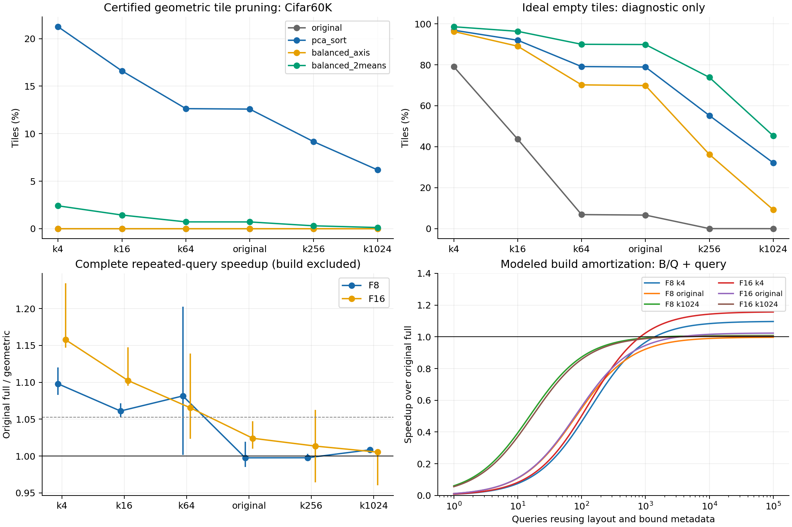

# 分块剪枝可行性实验

主机：`gpu-host-8`；GPU0 RTX PRO 6000 Blackwell Server Edition。
远程目录：`@TENSORJOIN_ROOT@/tensorjoin_20260908_block_feasibility`。

本轮实现了简单布局和保守几何剪枝，没有训练 flow matching 模型。所有性能比较均在本轮 GPU0 内部完成；没有与旧 GPU2 时间相除。

## 主要结果

冻结规则选择了 `pca_sort`：按第一主成分排序，并以投影包围盒等四类界的最大值剪枝。在 Cifar60K 上全部实际剪枝来自 32 维 PCA 投影界；球界、原坐标包围盒、16 个枢轴界没有额外贡献。

| 阈值 | 实际剪掉 tile | 该布局实际空 tile（理想诊断） | F8 查询加速 [95% CI] | F16 查询加速 [95% CI] |
|---|---:|---:|---:|---:|
| k4 | 21.25% | 96.89% | 1.098 [1.083, 1.120] | 1.158 [1.147, 1.234] |
| k16 | 16.60% | 91.99% | 1.061 [1.053, 1.072] | 1.102 [1.095, 1.148] |
| k64 | 12.63% | 79.14% | 1.082 [1.002, 1.203] | 1.065 [1.023, 1.139] |
| original | 12.58% | 78.91% | 0.998 [0.985, 1.019] | 1.024 [1.010, 1.047] |
| k256 | 9.16% | 55.23% | 0.998 [0.995, 1.003] | 1.014 [0.964, 1.063] |
| k1024 | 6.18% | 32.14% | 1.008 [1.006, 1.011] | 1.005 [0.960, 1.008] |

查询加速包括阈值掩码、tile 列表、输入上传、GPU metadata、扫描与精化、原始 ID 恢复、CUB 完整排序及 CPU 结果下载；复用 CPU 布局和几何 metadata，未计入建造成本。表中加速为原始全扫描 / 几何剪枝；仅重排对照保存在下表与 CSV。

六个阈值等查询权重时：

- F8：平均 125.023 → 122.515 ms，节省 2.006% [95% CI 1.169%, 2.785%]；5% 混合门槛：未通过。
- F16：平均 119.794 → 116.180 ms，节省 3.017% [95% CI 0.564%, 4.356%]；5% 混合门槛：未通过。

## 预处理和单次查询

18 次包含重新建造的完整单次查询中，建造平均 5.881 秒（范围 5.355–6.082 秒）。本实现为可审计的 CPU 通用筛选器，构造了全部四类界及块对下界矩阵；没有删除本轮无贡献的界。

| 工作点 | 路径 | 原始全扫描 ms | 仅重排 ms | 剪枝查询 ms | 实测完整单次查询 s | 建造摊销盈亏平衡查询数* |
|---|---|---:|---:|---:|---:|---:|
| k4 | F8 | 47.254 | 48.281 | 43.038 | 5.963 | 1396 |
| k4 | F16 | 52.057 | 51.018 | 44.961 | 5.806 | 829 |
| k16 | F8 | 51.127 | 52.713 | 48.183 | — | 1998 |
| k16 | F16 | 55.665 | 55.564 | 50.490 | — | 1137 |
| k64 | F8 | 68.607 | 66.899 | 63.434 | — | 1138 |
| k64 | F16 | 68.716 | 71.391 | 64.498 | — | 1395 |
| original | F8 | 71.549 | 74.093 | 71.721 | 5.806 | 无 |
| original | F16 | 72.654 | 75.911 | 70.943 | 6.016 | 3438 |
| k256 | F8 | 131.678 | 133.687 | 131.982 | — | 无 |
| k256 | F16 | 125.701 | 126.043 | 124.024 | — | 3507 |
| k1024 | F8 | 379.922 | 378.384 | 376.732 | 6.321 | 1844 |
| k1024 | F16 | 343.973 | 345.058 | 342.165 | 6.357 | 3254 |

*盈亏平衡由 `B / (T原始 − T剪枝)` 估算、向上取整；B 为全部完整单次调用的平均建造时间。这是静态数据复用布局/metadata 的模型，不是这些查询次数的实际批量测量。不缓存结果；不含初次 JIT、磁盘读输入或核验哈希。差值很小时估算不稳定。

## 布局机会与判界能力

| 布局 | k4 实际剪枝 | k4 理想空 tile | 原阈值实际剪枝 | 原阈值理想空 tile |
|---|---:|---:|---:|---:|
| original | 0.00% | 79.09% | 0.00% | 6.63% |
| pca_sort | 21.25% | 96.89% | 12.58% | 78.91% |
| balanced_axis | 0.00% | 96.26% | 0.00% | 69.87% |
| balanced_2means | 2.41% | 98.57% | 0.71% | 89.89% |

平衡二均值分组产生了更多空块，但本轮几何界识别率更低。因此“分组更像聚类”不足以推断剪枝更有效；需要同时考虑界的紧度与 GPU 执行成本。

理想占用掩码由完整参考结果反推。以下只是在事先免费知道该掩码时的乐观执行诊断，未包含获取答案的成本，不是可部署算法，也不是对其他布局/机制的严格上界。

| 工作点 | 路径 | 原始全扫描 ms | 几何剪枝 ms | 理想掩码执行 ms |
|---|---|---:|---:|---:|
| k4 | F8 | 47.254 | 43.038 | 23.679 |
| k4 | F16 | 52.057 | 44.961 | 23.715 |
| original | F8 | 71.549 | 71.721 | 52.661 |
| original | F16 | 72.654 | 70.943 | 48.507 |
| k1024 | F8 | 379.922 | 376.732 | 376.982 |
| k1024 | F16 | 343.973 | 342.165 | 338.073 |

## 其他分布和正对照

SIFT128 与 Fashion784 使用此前冻结的 4096 行样本及 k1/k16/k64 阈值。它们仅做 CPU 几何与完整参考占用核验，没有测 GPU 端到端加速，不能与主实验的速度混合。

| 数据 | 布局 | k1 剪枝 | k16 剪枝 | k64 剪枝 |
|---|---|---:|---:|---:|
| sift128 | original | 0.00% | 0.00% | 0.00% |
| sift128 | pca_sort | 47.60% | 45.77% | 43.03% |
| sift128 | balanced_axis | 18.32% | 6.15% | 0.82% |
| sift128 | balanced_2means | 36.39% | 14.42% | 3.89% |
| fashion784 | original | 0.00% | 0.00% | 0.00% |
| fashion784 | pca_sort | 58.75% | 45.53% | 36.97% |
| fashion784 | balanced_axis | 2.55% | 0.62% | 0.05% |
| fashion784 | balanced_2means | 43.22% | 30.05% | 20.29% |

打乱顺序的明显分离簇正对照，经平衡二均值分组剪掉 96.92% tile，且与全部参考占用一致；此结果只验证机制能在适当分布上工作。

## 正确性与统计边界

- 260 个布局/数据/阈值/界配置全部通过完整参考占用检查；被剪掉的 tile 没有参考命中。
- GPU 准入 49 次完整调用（其中 36 个普通配置），另有 108 次预热、432 次保留计时、18 次完整单次查询、18 次理想诊断；每次输出数量和完整 SHA256 匹配冻结 FP64 参考。准入还逐项比较数组。
- 新增 GPU 核只做整数 ID 映射，已检查空输入、边界、非整块长度、超过有符号 32 位的 ID 和 canary。F8、F16 算术核保持原有二进制身份。
- 独立扩展精度抽查确认了投影矩阵范数裕量、256 行投影误差包络及 8192 个原始点对的块界。它补充源级论证与完整输出核验，不替代普遍性证明；环境和检查结果见 `artifacts/environment.json`。
- 四个 GPU 独占守护进程全部通过，峰值设备占用 3176 MiB，未改变时钟或终止其他任务。
- 置信区间以进程和配对重复为单位进行 20000 次分层 bootstrap。只有三个独立进程簇，区间仅描述本轮重复性；没有独立工作负载确认集，不支持广泛性能主张。
- 数值合同仍是匹配指定 FP64 参考。保守几何界的源级误差论证见 NUMERICAL_SCOPE.md；保留原 F8/F16 算子的数值前提，不宣称整个系统无条件 exact-real。

## 对 flow matching 的判断

本实验提供了简单投影排序与块剪枝的实际证据，但没有提供 FM 优于简单方法的证据。若继续，先收缩到有贡献的投影界、降低预处理成本，并针对“实际空块很多但无法判出”的差距研究更紧界。FM 必须在相同可靠判界与完整成本条件下超过 PCA 等简单方法，才能成为必要组件。

## 文件与复现

- `PROTOCOL.md`、`NUMERICAL_SCOPE.md`：冻结设计与误差范围。
- `artifacts/screen_freeze.json`、`artifacts/timing_freeze.json`：筛选及计时依赖哈希。
- `artifacts/selection.json`：基于真实几何剪枝率选择布局，未使用 GPU 耗时或理想占用。
- `results/screen_*.json`、`results/confirm_*.json`、`raw/`：全部筛选、原始时间和守护记录。
- `analysis/summary.json`、`summary.csv`、`raw_times.csv`、`geometry.csv`、`block_feasibility.pdf`。
- `python analyze.py` 重建统计、报告与图。GPU 工作依赖原实验目录中的冻结数据、参考数组和算术核。
- 新目录运行顺序：CPU `src/screen.py` → 守护下 `src/admit.py` → `run_campaign.py`；已有结果禁止覆盖。
