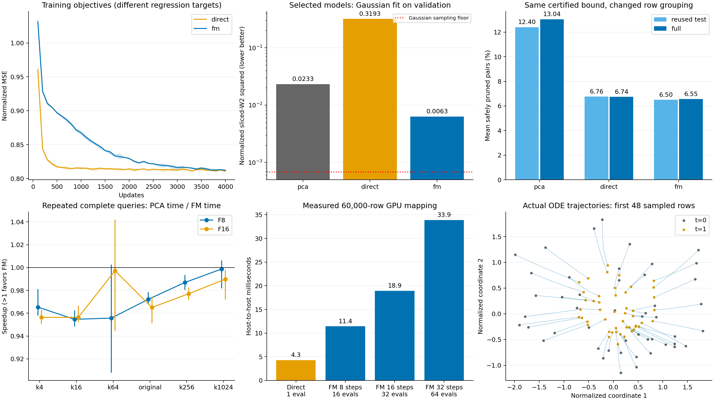

# 实际 Flow Matching 布局对照

本轮高斯化 FM 没有达到相对 PCA 的预定查询收益门槛。六阈值等查询权重下，FM 相对 PCA 的耗时变化为 F8 +1.965%，F16 +2.238%。

目录：`gpu-host-8:@TENSORJOIN_ROOT@/tensorjoin_20260908_fm_control`。所有性能比值来自本轮 GPU4；旧实验只读。

## 本轮回答的问题

本轮实际训练时间相关的 32 维速度场，并用 Heun ODE 积分得到布局坐标。比较对象是同一批 OT 配对、相近参数量、全部参数重训的一次前向 MLP，以及 PCA 排序。此前小网络的负结果不能推出 FM 的结果；以下结论来自本轮直接测量。

本轮选择“把数据输运到各向同性高斯，再分组”的 FM 策略。分布拟合成功与原始距离界的剪枝效率是两个指标。模型坐标只决定排列，可靠判界仍使用原始 PCA32 包围盒；因此没有把非线性输运后的距离当作原空间距离。

| 布局 | 参数数 | 选定分组规则 | 验证剪枝率 | 复用测试行剪枝率 | 全量剪枝率 |
|---|---:|---|---:|---:|---:|
| pca | — | first | 12.424% | 12.400% | 13.039% |
| direct | 24864 | first | 6.784% | 6.757% | 6.737% |
| fm | 24992 | first | 6.556% | 6.497% | 6.555% |

比例是六个既定阈值的等权平均；每个阈值按含自对的无序点对数计算。40,000/10,000/10,000 划分沿用前两轮，测试集已经在此前报告中出现；这是适应性后续实验，不能称为全新独立留出。PCA 也使用全部无标签数据。此次选型没有查看测试/全量几何或查询计时。

## FM 确实训练并执行了什么

设归一化原 PCA32 坐标为 u、目标高斯为 g，批大小 256。每批用 FP32 距离矩阵和 CPU 最小费用一对一指派得到 minibatch OT 配对；不是全数据全局 OT。采样 t∈[0,1]，令 z_t=(1−t)u+t g，最小化 ||vθ(z_t,t)−(g−u)||²/σ_g²。部署时从观测 u 出发求解 dz/dt=vθ(z,t)，得到 32 维终点。路径条件噪声取 0。公式依据 [Flow Matching](https://arxiv.org/abs/2210.02747) 与 [minibatch OT-CFM](https://arxiv.org/abs/2302.00482)；具体布局选择是本实验假设。

FM 为 33→128→128→32 SiLU，24,992 参数；直接映射为 u+rθ(u)，32→128→128→32 SiLU，24,864 参数。两者初始隐藏层匹配、输出层为零；FM 的时间输入列初始为零。全部层参与 Adam 训练，而不是仅优化读出层。每类三个种子，每种子 4,000 步，学习率 0.001；双方逐步消费完全相同的 OT 配对。

每个检查点允许第一坐标排序或按最大方差坐标递归平衡分块，每块 64 行。PCA 也允许两种规则。FM 另试 8/16/32 步 Heun；验证剪枝率选型。直接映射有 18 个候选，FM 有 54 个，后者搜索预算更大。18 份真实训练权重及全部 72 次候选评估均保留。

| 模型 | 选定种子 / 更新数 | 固定验证回归损失：初始→选定 | 高斯拟合 sliced-W2²/σ_g² |
|---|---|---:|---:|
| direct | 2026090832 / 4000 | 1.1576 → 0.8078 | 0.319335 |
| fm | 2026090832 / 1000 | 1.1576 → 0.8634 | 0.006330 |

原始归一化特征的 sliced-W2²/σ_g² 为 0.023347，两批独立高斯样本的有限采样基线为 0.000678。该诊断使用 64 个固定投影方向，不等于完整 32 维 W2。两种回归损失预测目标不同，不用其数值大小判定哪种模型更好。FM 在此分布指标上优于直接回归，但其选定布局剪枝率仍低于 PCA。在固定 8 步、第一坐标排序下，三个 FM 种子训练到 4000 步的分布误差进一步降至 0.00214–0.00285，验证剪枝率却降至 3.19%–4.31%；完整候选数据保存在 candidate_evaluations.csv。这一观察仍不足以排除更长训练或其他模型设计的可能。

## ODE 数值与实际映射成本

| 模型 | Heun 步数 | 实际网络求值 NFE | 6 万行映射 ms | 三个进程中位数 ms | 稠密层 GFLOP |
|---|---:|---:|---:|---|---:|
| direct | 0 | 1 | 4.293 | 4.293 / 4.221 / 4.364 | 2.949 |
| fm | 8 | 16 | 11.423 | 11.415 / 11.246 / 11.609 | 47.432 |
| fm | 16 | 32 | 18.925 | 18.798 / 18.788 / 19.189 | 94.863 |
| fm | 32 | 64 | 33.896 | 33.757 / 33.863 / 34.069 | 189.727 |

实际选定 8 步、16 次速度场调用。以上是 GPU4 上真实完整 32 维映射，包含 FP64 特征转 FP32、H2D、归一化、全部 ODE 调用和终点 D2H；模型已加载，不含 PCA/分组/下界构建。每个进程预热后保留七次，不删除慢样本。FLOP 只计稠密层乘加，不代表实际吞吐。

| 步数 | 对 64 步终点的相对 RMS 差 | 正向再反向的相对 RMS 差 |
|---|---:|---:|
| 8 | 0.000974327 | 0.000255626 |
| 16 | 0.000234681 | 3.20391e-05 |
| 32 | 4.72264e-05 | 4.01048e-06 |
| 64 | 0 | 5.36568e-07 |

数值诊断使用固定 1,024 行；64 步只是更细步长对照，不是精确解析解，也不据此重新选型。同一输入在 t=0.25 与 0.75 的速度差 RMS 为 0.0549049，说明模型使用了时间输入。零速度场恢复 PCA 验证剪枝率；Heun 另通过常向量场和线性场解析解、误差收敛和逆向积分检查。

## 完整查询计时

| 阈值 | 路径 | PCA ms | 直接映射 ms | FM ms | 原始全扫描 ms | FM 布局无剪枝 ms |
|---|---|---:|---:|---:|---:|---:|
| k4 | F8 | 45.112 | 47.822 | 46.732 | 48.372 | 49.583 |
| k4 | F16 | 47.090 | 50.416 | 49.240 | 53.338 | 52.645 |
| k16 | F8 | 48.805 | 51.172 | 51.124 | 51.208 | 52.536 |
| k16 | F16 | 51.278 | 53.853 | 53.617 | 55.890 | 55.733 |
| k64 | F8 | 62.208 | 65.274 | 65.090 | 61.947 | 65.084 |
| k64 | F16 | 63.808 | 66.160 | 63.988 | 65.386 | 66.211 |
| original | F8 | 63.413 | 65.475 | 65.230 | 64.149 | 66.696 |
| original | F16 | 63.770 | 66.180 | 66.080 | 66.379 | 67.463 |
| k256 | F8 | 92.125 | 93.763 | 93.345 | 91.807 | 93.929 |
| k256 | F16 | 84.112 | 85.814 | 86.092 | 85.710 | 86.543 |
| k1024 | F8 | 202.896 | 203.173 | 203.148 | 205.013 | 203.663 |
| k1024 | F16 | 166.477 | 168.729 | 168.183 | 168.595 | 167.402 |

这些查询复用 CPU 排列、重排数据及下界矩阵；包含阈值掩码、tile 列表、GPU 输入/metadata、全部计算与精化、原始 ID 恢复、CUB 完整结果排序和 CPU 下载。查询不重复执行网络或 ODE，因此这一比较已经允许学习布局充分复用。

| 路径 | FM 相对基线 | 六阈值平均耗时节省 [95% CI] | 三进程节省 | 预定 5% 门槛 |
|---|---|---:|---|---|
| F8 | pca | -1.965% [-3.041%, -1.364%] | -1.62% / -2.48% / -1.82% | 未通过 |
| F8 | direct | 0.382% [-0.214%, 0.944%] | 0.13% / 0.61% / 0.41% | 未通过 |
| F16 | pca | -2.238% [-3.284%, -1.612%] | -2.50% / -1.85% / -2.35% | 未通过 |
| F16 | direct | 0.805% [-0.194%, 1.611%] | -0.01% / 1.88% / 0.58% | 未通过 |

负节省表示 FM 更慢。点估计是三个进程各自四次重复中位数的均值；六阈值等查询次数加权。20000 次分层 bootstrap 成对重采样进程和重复。预定门槛为节省的 95% CI 下界至少 5%，并且三个进程方向都为正。只有三个进程簇，区间只反映本次实验内重复性；各阈值全部区间见 comparisons.csv，不挑最好单格下结论。

## 训练、建造与摊销

| 模型 | 选定检查点训练秒数 | 其中 OT 配对秒数 | 三种子全部训练＋初始化秒数 | 检查点评估秒数 |
|---|---:|---:|---:|---:|
| direct | 30.610 | 21.672 | 93.300 | 0.493 |
| fm | 7.719 | 5.418 | 94.384 | 1.795 |

每类独立部署都应付全额 OT 配对成本，不能因为实验共享配对就除以二。本实验两个模型共享配对的实际联合训练/评估阶段耗时 124.962 秒。该墙钟口径不含公共 CPU 准备、导入和守护等待；分项账单不含少量 Python/设置开销。“选定检查点训练”是事后已知选择的重训成本下限，不代表完成全部搜索的成本。

| 布局 | 实际完整布局建造平均秒数 |
|---|---:|
| pca | 0.4680 |
| direct | 0.4909 |
| fm | 0.4939 |

建造包含新做 PCA/特征、真实模型映射（FM 含 ODE）、分组、原 PCA32 保守下界及原始输入重排；模型已训练。每个确认进程实际重建 18 次，并逐位核对排列和下界。以下是完整重建后查询的实测总耗时。

| 布局 | 阈值 | 路径 | 实测建造＋查询秒数 |
|---|---|---|---:|
| pca | k4 | F8 | 0.5229 |
| pca | k4 | F16 | 0.5120 |
| pca | original | F8 | 0.5242 |
| pca | original | F16 | 0.5272 |
| pca | k1024 | F8 | 0.6692 |
| pca | k1024 | F16 | 0.6354 |
| direct | k4 | F8 | 0.5664 |
| direct | k4 | F16 | 0.5258 |
| direct | original | F8 | 0.5404 |
| direct | original | F16 | 0.5439 |
| direct | k1024 | F8 | 0.6800 |
| direct | k1024 | F16 | 0.6871 |
| fm | k4 | F8 | 0.5855 |
| fm | k4 | F16 | 0.5339 |
| fm | original | F8 | 0.5455 |
| fm | original | F16 | 0.5480 |
| fm | k1024 | F8 | 0.6864 |
| fm | k1024 | F16 | 0.6598 |

摊销按“训练成本差＋建造成本差”除以每次查询节省，分别保存选定检查点重训和全部种子/评估两种账单。没有正查询节省时记为 null；增加复用次数不会消除负的查询收益。估计见 summary.json 和 mixtures.csv。这些是基于实测分项的代数估算，不是重新执行数千次查询的成本测量。

## 解释范围与诊断

| 布局 | 全量平均 PC1 块宽度 | 全量平均 PCA32 包围盒对角线 |
|---|---:|---:|
| pca | 0.001842 | 2.655600 |
| direct | 0.159867 | 2.661004 |
| fm | 0.143659 | 2.665371 |

事后几何诊断表明，FM 确实改变了分组，但这些块在原始判界坐标中的范围更宽。这与剪枝率下降相符；它不是对训练目标与性能之间因果关系的独立证明。直接回归的输出方差收缩且分布拟合差；FM 改善了这一点，却没有使固定原坐标 AABB 更容易分离。

本轮结果只覆盖这套高斯化 OT-CFM、32 维公共特征、有限网络/训练预算和两种分组规则。它不能否定直接优化可证剪枝率的 FM、其他目标分布、更大模型/训练预算、不同数据或其他可靠判界结构。尤其不能把“FM 可以表达比小网络复杂的输运”直接等同于“高斯化终点必然带来更好的块剪枝”。

## 输出正确性与归档

- 36 个测试/全量布局阈值组合均未剪掉 FP64 参考命中。
- 75 次准入完整输出逐项匹配参考数组；180 次预热、720 次保留计时、54 次实际重建查询均核对完整输出数量与 SHA256，合计 1029 次。
- 算术内核、原始 ID 映射及 CUB 输出保持继承的冻结身份；数值范围见 inherited/NUMERICAL_SCOPE.md，不主张无条件 exact-real。
- 训练、准入和三个确认进程共五次 GPU4 守护均通过，最大设备占用 3244 MiB。
- 训练前冻结 PROTOCOL.md、METHODS.md、源代码和准备输入；选型后保存模型哈希，再冻结全部计时依赖。
- 结果文件：results/training.json、artifacts/model_selection.json、artifacts/admission.json、results/confirm_*.json、raw/。
- analysis/summary.json、comparisons.csv、mixtures.csv、raw_times.csv、mapping.csv、cold_queries.csv 可逐项复核统计。
- finalize_audit.py 在 CPU 上复核冻结依赖、18 份权重、全部输出和守护记录，生成 output_audit.json、环境/最终 GPU 状态和 archive_manifest.json。
- CPU src/prepare.py → CPU src/preflight.py → 守护下 src/train.py → 守护下 src/admit.py → run_campaign.py。复现使用新目录，禁止覆盖既有结果。
- python analyze.py 重建报告与独立 PNG/PDF；最终归档文件可对照 archive_manifest.json 校验。

