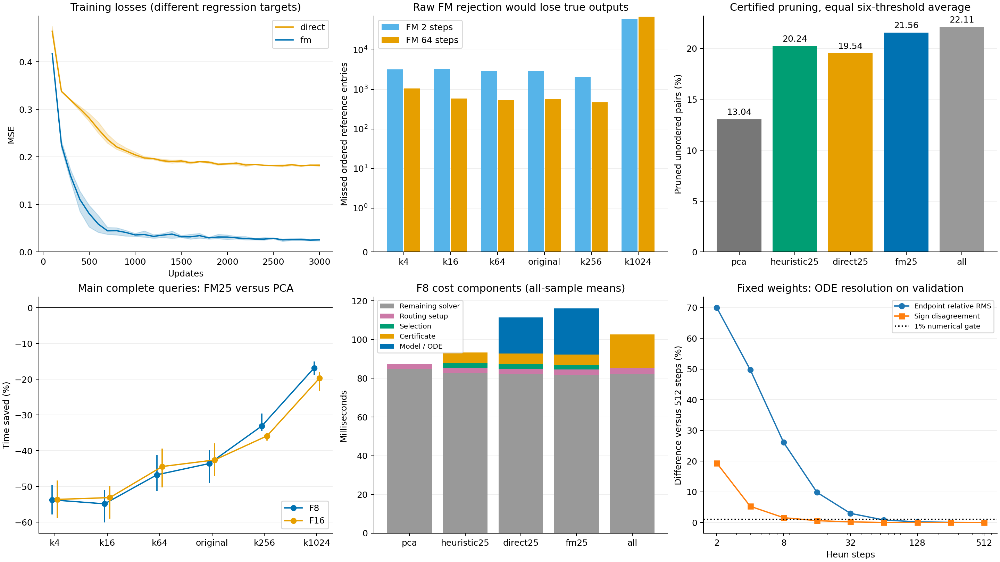

# 从数据初始状态到连接解的条件 FM 验证

主实验 FM25 未达到相对 PCA 的预定收益门槛。六阈值平均耗时变化：F8 +33.22%，F16 +35.68%。

目录：`gpu-host-8:@TENSORJOIN_ROOT@/tensorjoin_20260908_fm_solver`。所有性能比较使用本轮 GPU4；此前实验只读。

本轮实际学习“数据构造的粗糙状态→精确参考的块占用标签”，没有高斯目标或随机高斯起点。FM 只预测一个 64×64 点对块是否有命中；最终点对集合由可靠检查及原有算术核生成。这验证的是面向解的候选生成与补全，不是直接生成完整离散连接矩阵。

## 两个必须区分的结果

未经验证的 FM 判空仍可能漏掉真实输出，因此不能把模型终点直接称为精确解。所有安全执行只允许通过保守距离证书的块被丢弃；模型判空但证书不通过的块全部继续计算。

| 阈值 | 主实验 FM 两步直接判空会漏掉的输出条目 | 加密积分后会漏掉的输出条目 |
|---|---:|---:|
| k4 | 3,212 | 1,066 |
| k16 | 3,278 | 592 |
| k64 | 2,920 | 546 |
| original | 2,940 | 560 |
| k256 | 2,050 | 474 |
| k1024 | 61,768 | 69,208 |

条目按原输出格式计数，同一个非自对通常包含两个方向。这里是假设直接删除模型判空块的诊断，正式执行从未这样剪枝。完整误报/漏报、候选召回率和验证/测试结果见 raw_prediction_metrics.csv。

安全版本合计 1835 次完整调用均匹配参考输出数量与 SHA256；其中 161 次逐项比较完整数组。全量所有主配置/阈值的 48 个掩码，以及补充积分配置的掩码，均未剪掉参考命中。

## 实际模型、监督和选型

条件为 20 个数据几何统计加查询阈值。初始状态 a=tanh((T−粗距离估计)/(0.25T))，监督终点 y 为有命中 +1、无命中 −1。采样 t，构造 z_t=(1−t)a+ty，回归速度 v(c,z_t,t)≈y−a。推理实际积分 dz/dt=v(c,z,t)。这是条件监督插值；不宣称有限步 ODE 精确输运到离散分布。非高斯来源与配对条件路径的依据见 [CFM](https://arxiv.org/html/2302.00482v4)，具体状态与证书设计是本实验选择。

FM 为条件仿射层 21→64、状态/时间权重、SiLU、64→64、SiLU、标量输出，共 5761 参数。直接残差网络删除时间输入，共 5697 参数。隐藏层/状态初始权重匹配、输出层为零；全部参数参与训练。三个种子，每类每种子 3000 步、batch 1024，相同训练样本、Adam lr 0.001。只缓存每次推理中与状态和时间无关的首层条件仿射项，其他速度场求值全部实际执行。

| 模型 | 选定种子 / 更新数 | ODE 步数 / NFE | 验证集额外可靠剪枝 |
|---|---|---|---:|
| direct | 2026090912 / 3000 | 0 / 1 | 6.048% |
| fm | 2026090913 / 3000 | 2 / 4 | 8.074% |

选择依据是：在相同 25% 额外检查预算下，六个验证阈值平均增加的可靠剪枝量。FM 尝试 2/4/8 步，共 27 候选；直接网络九候选。全部 18 权重与 36 次评估保留。没有用测试标签、全量证书结果或查询耗时选择主模型。两类回归预测目标不同，固定回归诊断的抽样也不同，不能横向比较其损失数值；实际选型使用同一完整验证块集合。

训练/验证/测试按整块分开，行数为 40000/9984/10016，只使用两个端点块均属于相应划分的点对。PCA 使用全体无标签数据，同一数据集已在先前报告中出现；这是适应性后续实验，不是新数据泛化证据。监督标签从已有精确参考中提取，因此不能把标签当作首次求解时无代价获得的答案。

## 新增可靠检查和各项对照

先应用原 PCA32 包围盒；模型或规则从剩余非对角块中选择固定比例进行更细检查。新增 GPU 核计算块中实际 4096 对的投影距离下界，每八维检查一次，可在 8/16/24 维提前结束，最多 32 维。所有投影、FP32 舍入和阈值误差都计入保守余量；当前全局绝对余量为 0.000253584。细节见 CERTIFICATE_SCOPE.md。未经此检查证明为空的块继续走原求解器。

| 策略 | 剩余块的额外检查预算 | 全量总可靠剪枝率 | 检查成功率 |
|---|---:|---:|---:|
| pca | 0% | 13.039% | 0.00% |
| all | 100% | 22.107% | 10.74% |
| heuristic25 | 25% | 20.243% | 33.82% |
| random25 | 25% | 15.303% | 10.73% |
| direct25 | 25% | 19.544% | 30.62% |
| fm05 | 5% | 14.499% | 35.36% |
| fm10 | 10% | 17.180% | 49.03% |
| fm25 | 25% | 21.561% | 40.21% |

pca 为原下界；all 为全部新增检查；heuristic25 按数据粗估计排序；random25 随机选择；direct25 与 fm25 使用相同预算。fm05/fm10 检查 FM 在较低预算下能否抵消推理成本。总剪枝率按无序点对数量加权后对六阈值等权平均。all 体现当前证书可达到的范围，并不读取理想空块标签进行路由。

## 主实验完整查询时间

| 阈值 | 路径 | PCA ms | 全部检查 ms | 启发式25 ms | 直接网络25 ms | FM25 ms |
|---|---|---:|---:|---:|---:|---:|
| k4 | F8 | 47.087 | 58.877 | 51.741 | 69.732 | 72.392 |
| k4 | F16 | 49.229 | 60.777 | 53.400 | 69.979 | 75.620 |
| k16 | F8 | 49.872 | 63.957 | 55.011 | 72.960 | 77.224 |
| k16 | F16 | 52.596 | 65.002 | 56.937 | 76.022 | 80.525 |
| k64 | F8 | 58.770 | 74.591 | 65.765 | 83.675 | 86.226 |
| k64 | F16 | 59.777 | 74.401 | 65.098 | 82.121 | 86.324 |
| original | F8 | 60.264 | 74.635 | 65.878 | 82.821 | 86.522 |
| original | F16 | 60.388 | 74.790 | 65.701 | 82.187 | 86.099 |
| k256 | F8 | 95.207 | 112.688 | 102.630 | 119.623 | 126.701 |
| k256 | F16 | 86.428 | 103.998 | 92.934 | 114.016 | 117.414 |
| k1024 | F8 | 210.556 | 229.473 | 217.772 | 239.315 | 245.998 |
| k1024 | F16 | 172.376 | 190.742 | 182.335 | 201.933 | 206.375 |

计时包含每次重新构造模型条件、真实 ODE、排序选择、实际证书检查、GPU 输入/metadata、原始算术与精化、ID 恢复、CUB 完整结果排序和 CPU 下载。复用的是查询无关的 CPU 索引与摘要，没有复用模型预测或证书结果。模型权重已加载；训练与索引建造另计。

| 路径 | FM25 相对基线 | 六阈值平均耗时节省 [95% CI] | 5% 门槛 |
|---|---|---:|---|
| F8 | pca | -33.22% [-34.84%, -31.86%] | 未通过 |
| F8 | heuristic25 | -24.39% [-25.84%, -23.13%] | 未通过 |
| F8 | direct25 | -4.03% [-5.14%, -3.06%] | 未通过 |
| F16 | pca | -35.68% [-38.09%, -33.90%] | 未通过 |
| F16 | heuristic25 | -26.33% [-27.33%, -25.14%] | 未通过 |
| F16 | direct25 | -4.17% [-4.89%, -2.60%] | 未通过 |

负节省表示更慢。主点估计为三个进程各自四次重复中位数的均值；20000 次成对分层 bootstrap。只有三个进程簇，置信区间限于本轮重复性。主门槛为节省下界至少 5%，且三个进程方向均正。其余预算、随机对照和每格比较完整保存在 times.csv、comparisons.csv、mixtures.csv；未删除慢样本。

## ODE 精度补充验证

主实验选中了两步 Heun，但其 512 个诊断终点相对 16 步差异达 68.20%。因此，主实验的两步推理不能称为已收敛的连续流求解。保留主实验冻结结果，另开固定权重的积分加密检查。

| Heun 步数 | 验证样本终点相对 RMS 差（对 512 步） | 符号判断分歧 |
|---|---:|---:|
| 2 | 69.9670% | 19.3359% |
| 4 | 49.7787% | 5.2734% |
| 8 | 26.0630% | 1.5625% |
| 16 | 9.7991% | 0.5859% |
| 32 | 2.9738% | 0.1953% |
| 64 | 0.8049% | 0.0000% |
| 128 | 0.2005% | 0.0000% |
| 256 | 0.0414% | 0.0000% |
| 512 | 0.0000% | 0.0000% |

补充检查在 512 个验证块输入上按预先写定的 1% RMS/1% 判断分歧门槛选定 64 步；数值门槛通过。512 步仍只是数值参考。权重不变，不看测试标签或查询耗时选步长；此补充本身是发现误差后的适应性实验。

| 路径 | 同进程 PCA ms | 启发式25 ms | 直接网络25 ms | 加密积分 FM25 ms |
|---|---:|---:|---:|---:|
| F8 | 82.735 | 88.725 | 105.249 | 312.080 |
| F16 | 76.529 | 82.014 | 98.443 | 305.451 |

补充验证是一个新进程、每格一次预热和三次保留重复，共 192 次完整调用。这些同进程比值只作描述，不沿用主实验三进程置信区间，也不把不同阶段耗时直接相除。

## 推理、训练和建造成本

| 模型 | 步数 / NFE | 原阈值剩余块数量 | 推理平均进程中位数 ms |
|---|---|---:|---:|
| direct | 0 / 1 | 384,033 | 6.831 |
| fm | 2 / 4 | 384,033 | 11.804 |
| fm | 4 / 8 | 384,033 | 19.664 |
| fm | 8 / 16 | 384,033 | 33.404 |

独立推理计时从已准备的主机摘要/初始状态到主机终点，含归一化、H2D、实际各步和 D2H；正式查询还计入摘要选择、初态构造等工作。每进程预热后七次保留重复，完整分项见 components.csv。

| 模型 | 选定检查点训练＋初始化秒数 | 三种子训练＋初始化秒数 | 检查点评估秒数 |
|---|---:|---:|---:|
| direct | 6.374 | 20.025 | 0.263 |
| fm | 6.992 | 21.386 | 0.864 |

本轮联合训练阶段墙钟 44.079 秒，标签提取 2.363 秒，验证证书准备 1.033 秒。已有全量 FP64 参考生成记录为 33.584 秒，该值来自历史记录，不是本轮 GPU4 重测，也未包含在本轮标签提取时间中。选定检查点训练账单是已知选择后的重训下限；独立模型负担完整共享批准备成本。

| 策略 | 新建所需索引平均秒数 |
|---|---:|
| pca | 0.4726 |
| all | 0.4833 |
| heuristic25 | 1.2020 |
| direct25 | 1.1955 |
| fm25 | 1.2017 |

索引构造包含 PCA、原界、重排，以及相应策略需要的数据摘要。主实验另有 90 次实际建造后查询，完整数据见 cold_queries.csv。训练成本、标签成本与额外建造成本除以正查询节省得到的摊销估计保存在 mixtures.csv；查询本身无正节省时记为 null。相同查询已有完整答案时还可直接缓存答案，不能把此实验的监督标签视为首次求解的免费资源。

## 结论范围和复核

本轮把用户提出的思路实现为有监督的块候选状态修正。原始预测、可靠补全以及 ODE 数值精度分别检查，没有把高候选召回率或低训练损失当作精确解证明。它仍受摘要信息量、标量块状态、网络与训练预算限制；没有测试完整点对状态、更强条件编码、新数据泛化或其他更便宜的精确补全方式。

- 训练、选型、证书和计时依赖均保存冻结哈希；原算术/输出实现身份保持一致。
- 两个训练前开发失败及对应源码保留：提前结束分支的 Triton break 语法不支持；预检未列出有效的 24 维提前结束。修正后完整预检通过，再冻结训练。
- 初始裸模块导入检查的 admit/runner 名字解析到了继承模块；实际工作进程始终按新文件绝对路径执行。analysis/import_paths.json 另核验了实际入口及新 engine/train 函数身份。
- 七个成功守护阶段最高 GPU4 占用 3226 MiB；两个开发失败另行保留，未终止其他任务或修改时钟。
- analysis/output_audit.json、最终环境/GPU 状态、archive_manifest.json 记录归档核验；manifest 仅排除缓存目录和自身。
- 主复现入口：CPU prepare.py → GPU 守护下 preflight.py → train.py → admit.py → run_campaign.py；随后按 resolution_check/PROTOCOL.md 执行积分补充。禁止覆盖旧结果。
- python analyze.py 重建统计、报告与独立 PNG/PDF。正式数值范围见 CERTIFICATE_SCOPE.md 和 inherited/NUMERICAL_SCOPE.md，不主张无条件 exact-real。

