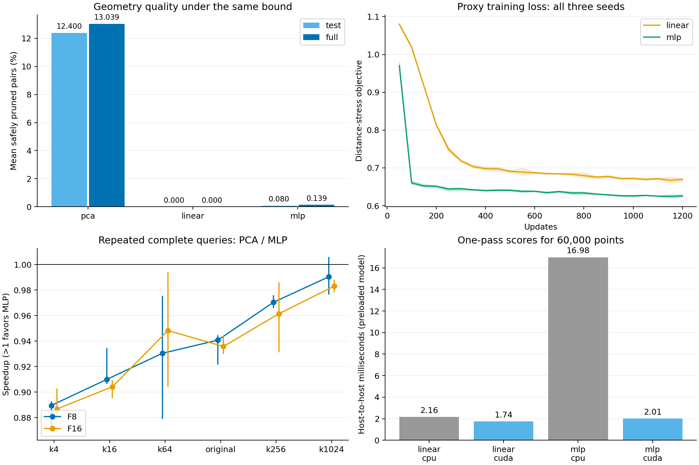

# 一次前向小网络布局验证

远程目录：`gpu-host-8:@TENSORJOIN_ROOT@/tensorjoin_20260908_learned_layout`。
所有执行比较都在本轮 GPU0 内完成。训练/模型选型、准入和三个确认进程分别经独占守护。

本轮验证上条建议中的“小网络直接输出排序坐标”，没有训练 flow matching，也没有 ODE 推理。测得的成本不能直接作为多步 FM、向量场网络或跨点注意力模型的成本。

## 结果判断

当前距离保持代理目标没有产生超过 PCA 的可用布局。网络本身规模很小，但学到的排序显著削弱了固定 PCA 坐标包围盒的判界能力。这支持停止本轮具体训练目标，不证明所有神经布局或 FM 都无效。

| 布局 | 参数数 | 验证行平均剪枝 | 测试行平均剪枝 | 完整数据平均剪枝 |
|---|---:|---:|---:|---:|
| pca | — | 12.4243% | 12.4001% | 13.0389% |
| linear | 33 | 0.0010% | 0.0000% | 0.0000% |
| mlp | 6337 | 0.1331% | 0.0802% | 0.1388% |

剪枝为六个既定阈值的等权平均、按无序点对数（含自对）加权的比例。完整数据是实际部署输入，包含训练和验证行；测试行未参与梯度或模型选型。共同 PCA 特征使用全部无标签坐标，因此这是同一数据集内的留出检查，不是独立数据分布泛化。

## 模型与训练成本

共同输入为已有 32 维 PCA 特征。MLP 为 32→64→64→1、ReLU、PCA 分数残差，6337 个参数；线性残差只有 33 个参数。输出只用于排序，可靠判界始终使用原有 PCA32 投影误差包络。

为 8192 个训练锚点构造 top-8 训练邻居的 GPU GUIDE 计算耗时 0.223 秒，共计算 327,680,000 个训练引导距离。该图没有用于连接候选生成或正确性判定。

| 模型 | 选定随机种子/更新数 | 该检查点训练秒数 | 各种子完整 1200 步训练秒数 |
|---|---|---:|---|
| linear | 2026090816 / 300 | 0.396 | 1.919 / 1.580 / 1.575 |
| mlp | 2026090815 / 300 | 0.682 | 2.791 / 2.731 / 3.111 |

训练时间在 CUDA 同步边界计时，剔除检查点保存与验证暂停；共同 PCA 时间保存在 artifacts/features.json；图准备、初始化、训练历史和验证时间保存在 results/training.json。每类模型尝试三个随机种子和三个检查点，共保留 18 个候选；始终按验证剪枝率选型，没有用测试/完整数据或 GPU 查询时间选模型。

六个完整训练运行累计更新耗时 13.707 秒；图准备、全部训练和验证所在计时段共 14.263 秒。这不含共同 PCA 准备、守护等待、导入或后续查询验证。

## 一次映射与建造布局的成本

| 模型 | 执行设备 | 6 万行一次映射 ms | 三个进程中位数 ms |
|---|---|---:|---|
| linear | cpu | 2.164 | 2.019 / 2.379 / 2.093 |
| linear | cuda | 1.742 | 1.778 / 1.713 / 1.736 |
| mlp | cpu | 16.981 | 16.509 / 17.888 / 16.545 |
| mlp | cuda | 2.005 | 2.007 / 2.004 / 2.005 |

映射时间包括从 FP64 公共特征转换为 FP32、GPU 路径的 H2D、模型前向与分数 D2H；模型权重已加载。CPU 路径使用四线程。表中不含 PCA 拟合、分组排序和距离界构造。MLP 稠密层的乘加约为 0.745 GFLOP/6 万行，仅是算术量估算；不是实际耗时或 FM 成本推算。

| 布局 | 本轮完整布局建造平均秒数（已训练模型） |
|---|---:|
| pca | 0.4759 |
| linear | 0.4913 |
| mlp | 0.4883 |

建造包含重新拟合 PCA、特征计算、模型映射、稳定排序、64 行分块、保守投影包围盒与块对下界矩阵，以及原始输入重排。所有布局均删除了上一轮在 Cifar 上无贡献的球界/原坐标界/枢轴界；PCA 的六个保留掩码与上一轮完全一致。这里只报告本轮成本，不用新旧查询时间相除。

## 完整查询性能：首先对比 PCA

| 阈值 | 路径 | PCA ms | 线性 ms | MLP ms | PCA/MLP [95% CI] |
|---|---|---:|---:|---:|---:|
| k4 | F8 | 45.093 | 51.704 | 50.692 | 0.890 [0.869, 0.893] |
| k4 | F16 | 47.353 | 54.922 | 53.400 | 0.887 [0.880, 0.903] |
| k16 | F8 | 48.984 | 54.303 | 53.830 | 0.910 [0.906, 0.935] |
| k16 | F16 | 51.359 | 57.305 | 56.803 | 0.904 [0.895, 0.909] |
| k64 | F8 | 62.936 | 68.449 | 67.643 | 0.930 [0.879, 0.976] |
| k64 | F16 | 63.313 | 69.388 | 66.767 | 0.948 [0.904, 0.994] |
| original | F8 | 63.920 | 68.247 | 67.944 | 0.941 [0.922, 0.945] |
| original | F16 | 64.241 | 68.893 | 68.647 | 0.936 [0.930, 0.944] |
| k256 | F8 | 94.679 | 98.363 | 97.565 | 0.970 [0.966, 0.976] |
| k256 | F16 | 87.996 | 91.949 | 91.522 | 0.961 [0.931, 0.986] |
| k1024 | F8 | 215.340 | 218.511 | 217.409 | 0.990 [0.976, 1.006] |
| k1024 | F16 | 179.616 | 183.513 | 182.684 | 0.983 [0.978, 0.988] |

大于 1 才表示 MLP 更快。计时复用 CPU 布局与下界矩阵，包含阈值掩码、tile 列表、新 GPU 输入和 metadata、全部计算/精化、原始 ID 恢复、CUB 完整结果排序及 CPU 下载。训练和布局建造不包含在这张表中；原始全扫描与 MLP 无剪枝对照也完整保存于 summary.csv。

| 路径 | 学习布局 | 六阈值等查询权重耗时节省 vs PCA [95% CI] | 5% 门槛 |
|---|---|---:|---|
| F8 | linear | -5.391% [-6.410%, -4.761%] | 未通过 |
| F8 | mlp | -4.545% [-5.207%, -3.831%] | 未通过 |
| F16 | linear | -6.498% [-7.222%, -5.901%] | 未通过 |
| F16 | mlp | -5.253% [-6.135%, -4.521%] | 未通过 |

负的节省表示比 PCA 更慢。三个独立进程，各配置每进程四个保留重复；按进程和成对重复进行 20000 次分层 bootstrap。只有三个进程簇，置信区间限于本轮重复性。

## 单次重建后查询与摊销

| 布局 | 阈值 | 路径 | 实测建造＋完整查询秒数 |
|---|---|---|---:|
| pca | k4 | F8 | 0.5251 |
| pca | k4 | F16 | 0.5183 |
| pca | original | F8 | 0.5324 |
| pca | original | F16 | 0.5392 |
| pca | k1024 | F8 | 0.6931 |
| pca | k1024 | F16 | 0.6621 |
| linear | k4 | F8 | 0.5709 |
| linear | k4 | F16 | 0.5311 |
| linear | original | F8 | 0.5440 |
| linear | original | F16 | 0.5425 |
| linear | k1024 | F8 | 0.6966 |
| linear | k1024 | F16 | 0.7027 |
| mlp | k4 | F8 | 0.5856 |
| mlp | k4 | F16 | 0.5289 |
| mlp | original | F8 | 0.5415 |
| mlp | original | F16 | 0.5445 |
| mlp | k1024 | F8 | 0.6951 |
| mlp | k1024 | F16 | 0.6659 |

这些调用实际重新建造布局，但模型已训练；不把训练时间误称为已包含。相对 PCA 的摊销估算使用“图准备＋选定检查点训练＋额外建造时间”，除以每次查询节省；若学习布局本身的查询更慢，则复用更多次也不能靠摊销弥补。各格估算（没有正节省时为 null）保存在 summary.json；接近零的时间差不宜据此作部署决策。

## 为什么损失下降而剪枝变差

| 布局 | 完整数据平均 PC1 块宽度 | 平均 PCA32 包围盒对角线长度 |
|---|---:|---:|
| pca | 0.001842 | 2.655600 |
| linear | 0.848589 | 2.794238 |
| mlp | 0.560061 | 2.717997 |

这是事后诊断：PCA 排序使同一块在 PC1 方向非常窄；学习后的排序混合了多个方向，在固定 PCA 坐标轴上块区间变宽，更容易重叠。训练优化的是点对距离保持代理目标，并未直接优化可安全剪掉的块数。零残差网络控制恢复了 PCA 的验证剪枝率，排除了“评估器无法处理网络分数”的简单解释。

这一结果同时受训练代理目标、单一排序坐标和固定判界坐标轴约束。没有测试直接针对分块判界的目标、随线性排序方向旋转的包围盒、其他可证明界或 FM；不能把它扩大为所有学习布局的否定结论。

## 正确性、资源和复现

- 测试行/完整数据的 36 个布局阈值组合均未剪掉参考命中。
- 75 次准入完整调用逐项匹配 FP64 参考；另有 180 次预热、720 次保留计时、54 次建造后查询；合计 1029 次完整输出数量和 SHA256 均匹配。
- 算术核和共同输出实现保持冻结身份；新模型只改变排列，原始 FP64 判定合同不变。继承数值范围见 inherited/NUMERICAL_SCOPE.md，未主张无条件 exact-real。
- 五个守护进程均通过；最大设备占用 3244 MiB，未改时钟或终止其他任务。
- `PROTOCOL.md`、`artifacts/training_freeze.json`、`model_selection.json`、`timing_freeze.json` 保存冻结依据。
- `results/training.json` 保存全部 18 候选与训练曲线，`artifacts/*.pt` 保存模型权重。
- `artifacts/admission.json`、`results/confirm_*.json`、`raw/` 保存几何、完整输出与原始计时。
- `analysis/summary.json`、`summary.csv`、`raw_times.csv`、`mapping.csv`、`cold_queries.csv`。
- `analysis/output_audit.json` 复核全部输出记录；`analysis/final_environment.json`、`analysis/final_gpu_state.json` 和 `archive_manifest.json` 保存环境与归档核验。
- `python analyze.py` 重建本报告与 PNG/PDF 图；旧数据与数值核由原实验目录只读提供。
- 从新目录复现：CPU `src/prepare.py` → 守护下 `src/train.py` → 守护下 `src/admit.py` → `run_campaign.py`；禁止覆盖已有结果。

